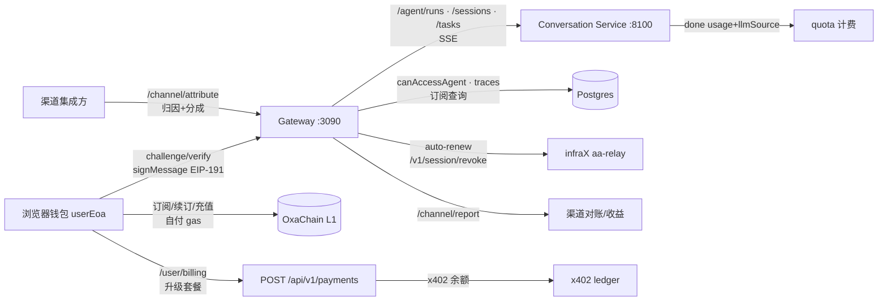

# AgentX C 端用户 — 全流程测试场景

> 范围：C 端（终端用户 / Subscriber）从钱包登录 → 浏览市场 → 订阅/购买 → 对话使用 → 会话/并行任务 → A2A 编排 → 定时任务 → Billing（套餐/用量/升级）→ 订阅管理/自动续订 → 账户安全 → 渠道归因/收益分成 → 调用追踪审计 → 技能市场 → 支付幂等 → 故障韧性/安全渗透 → 前端 UI/本地化/限流/可访问性的完整端到端流程。
> 覆盖 gateway `routes/{chat,chat-tasks,agent-runs,payments,x402,fiat,agents,chain,billing,auto-renew,schedules,a2a,skills,channel,traces,developer}.ts` + `middleware/{auth,rate-limiter}.ts` + 前端 `user/*`、`marketplace/*`（含 `skills`、`plans`）、`a2a` 页面与 `components/{chat,user,a2a,agent,guard}`。
> 用例总数：**369 条（C01–C369）**，其中 §2–§17 + §19 + §20 为 API/契约/韧性与安全层 256 条，§2A–§11A + §18 为前端 UI/深度边界层 113 条。
> 生成日期：2026-08-20（首次生成）· 2026-08-20（扩充前端 UI 与深度边界层）· 2026-08-20（二轮扩充：渠道归因/追踪审计/技能市场/支付幂等竞态/故障韧性/安全渗透/前端韧性可访问性）· 2026-08-20（三轮补充：路由代码边界条件）· 2026-08-20（四轮补充：全局异常与中间件异常场景）

---

## 0. 关键事实（测试断言依据）

| 事实 | 值 |
|---|---|
| 生产入口 | `https://agentx.0xainet.top`（本地开发 `http://localhost:3090`，CORS/域名无差异） |
| C 端鉴权 | `Authorization: Bearer <JWT>`（钱包登录签发）；或 `X-Api-Key: agentx_…`（api_key 一次性返回，仅 R19.1 前 legacy 明文可再查询） |
| 钱包登录 | `GET /api/v1/auth/challenge?address=0x…` → `{ challenge:'agentx:auth:<ts>:<nonce>', timestamp, nonce }` → 前端 `walletClient.signMessage`（EIP-191 personal_sign，`ethers.verifyMessage` 可恢复地址）→ `POST /api/v1/auth/verify` |
| verify body | `{ wallet_address, signature, timestamp, nonce }`；C 端**省略 `intent`**（`intent='partner'` 为 B 端） |
| verify 响应 | `{ access_token, expires_in, tenant, api_key, is_new }`；首次注册 `kind='user'`、free plan、`quota_daily=0`、`rate_limit_rpm=5`、`max_concurrent=1`、`api_key` **仅本次返回** |
| challenge TTL | 5 分钟（Redis `auth:challenge:<address>`，跨 worker 共享） |
| 访问边界 | 只能与自己写的 / 已订阅的 Agent 对话/建会话/建任务；否则 `403 AGENT_ACCESS_DENIED`；x402 按次付费通过者除外 |
| 平台计费 | 平台 LLM 模式按 done 事件 `usage` 精确计费，扣 `plans.quota_daily`（`updateQuota`）；`quota_used ≥ quota_daily` → `429 Platform quota exhausted` |
| SSE 事件（对话/任务） | `text_delta` / `tool_call` / `task_result` / `done(usage+llmSource:'byok'|'platform')` / `onchain_approval_required` / `error` |
| 错误码速查 | `400` 缺参/无 LLM 配置/无效 tenant key · `401` challenge/签名/token 无效 · `402` x402 需付费 · `403` suspended / `AGENT_ACCESS_DENIED` / `PARALLEL_TASKS_DISABLED` · `404` hashed key 不可查 / 未知路径 · `422` 套餐购买金额不足 · `429` quota 耗尽 / 限流 |
| 三轨支付 | 统一 `POST /api/v1/payments`（purpose=`subscribe`\|`tenant-plan`；chain/fiat/x402 三轨）；chain 需携带链上 `txHash`，fiat 返回 Stripe checkout，x402 走预付余额 |
| 链上订阅合约 | SubscriptionManager v3（生产地址见 `gateway/src/config.ts`；测试见 [test-cases-aa-auto-renew.md](test-cases-aa-auto-renew.md) §0） |
| 自动续订 | t9 ERC-4337 Session（详见图谱 `docs/test-cases-aa-auto-renew.md`，本文 §10 仅列 C 端入口与断言） |

---

## 1. Fixtures

- **userEoa**：浏览器钱包（wagmi），oxachain 持有 OXA（订阅/充值/自付 gas）
- **agent**：已在链上发布并有 Active plan 的 agent（含 category、metadata、plan 列表）
- **plan**：ETH 计费 plan（price=0.001 OXA，active；ERC20 计费计划链上 `subscribe` 会 revert）
- **subActive**：userEoa 的 Active 订阅（`chain_subscriptions`，status=1）
- **subExpired**：Expired 订阅（status=2）
- **payWallet**：x402 充值钱包（scrip 见 `scripts/local-payments`）
- **conversationMock**：mock Conversation Service（`createSession/createTask/listTasks/getTask/streamTaskEvents/cancelTask` 返回约定 SSE）
- **Gateway**：`GET /api/v1/health` 200 为前提；`X-Orchestrate-Token` 内部回调仅 conversation 调用

---

## 2. 认证与账户（middleware/auth.ts）

| # | 用例 | 前置 | 操作 | 预期 |
|---|---|---|---|---|
| C01 | 获取 challenge | 无 | `GET /api/v1/auth/challenge?address=0xabc…` | 200，`challenge` 匹配 `^agentx:auth:\d+:[0-9a-f]{32}$`，含 `timestamp/nonce` |
| C02 | challenge 缺地址 | 无 | `GET /api/v1/auth/challenge` | 400 `Missing wallet address` |
| C03 | challenge 大小写归一 | — | 传大写地址 | 200，Redis 键为小写地址（后续 verify 用小写通过） |
| C04 | 首次登录（C 端新钱包） | 钱包未注册 | `POST /api/v1/auth/verify`（省略 intent，正确签名） | 200，`is_new:true`、`tenant.kind='user'`、`tenant.plan_slug='free'`、`api_key` 一次性返回、`access_token` 可访问受保护端点 |
| C05 | 老用户重复登录 | C04 已注册 | 再 verify（重新 challenge） | 200，`is_new:false`，kind 仍 `user` |
| C06 | challenge 过期/未请求 | 未先 challenge 或超 5 分钟 | 直接 verify | 401 `Challenge expired or not found` |
| C07 | nonce 不匹配 | challenge 后篡改 nonce | verify 传错误 nonce | 401 `Challenge expired or not found` |
| C08 | 签名非法 | — | verify 传随机 `0x` 签名 | 401 `Invalid signature` |
| C09 | 签名地址不符 | — | 用 A 钱包签、传 B 地址 | 401 `Signature does not match wallet address` |
| C10 | 缺参 | — | verify 缺 `wallet_address` 或 `signature` | 400 `Missing wallet_address or signature` |
| C11 | suspended 账户 | 管理员置 tenants.status='suspended' | verify | 403 `Account suspended` |
| C12 | challenge 轮换 | 已 challenge 两次 | 用第一次 nonce verify | 401（第二次 challenge 覆盖前者） |
| C13 | Bearer 访问受保护端点 | C04 的 token | `GET /api/v1/billing/balance` 带 `Authorization: Bearer` | 200 |
| C14 | 无效/过期 token | — | 篡改 token 或超时 | 401 `Invalid or expired token` |
| C15 | 无鉴权头 | — | 访问 `/api/v1/billing/balance` | 401 `Missing or invalid Authorization header` |
| C16 | X-Api-Key 鉴权 | C04 的 api_key | 访问受保护端点带 `X-Api-Key: agentx_…` | 200 |
| C17 | 无效 API Key | — | 随机 `agentx_…` | 401 `Invalid API key` |

> **🔧 2026-08-20 修复：跨秒首次登录 401（浏览器 J1 流程实测发现）**
> **症状**：浏览器直连生产首次登录（`/user/billing` 自动 authenticate）`verify` 返回 401 `Signature does not match wallet address`，刷新后才成功——高延迟/慢网络下必现。
> **根因**：服务端 `verifyChallenge` 用**请求体的 `timestamp`** 重建 `agentx:auth:<ts>:<nonce>` 验签；而前端 `useGatewayAuth`/`usePartnerGatewayAuth`/`settings/page.tsx` 传的是**自身 `Date.now()/1000`**（非 challenge 返回的 timestamp）。跨秒时重建 message 的 ts 比签名时 +1 → 验签失败。
> **修复**：① 服务端 [auth.ts](gateway/src/middleware/auth.ts) 改用**服务端保存的 `challenge.timestamp`**（权威值）重建 message，不再信任客户端 timestamp；② 前端 3 处改传 challenge 响应的 `timestamp`。gateway 157/157（含新增回归用例 `verifyChallenge — server-timestamp authority`）、前端 tsc 0 错。
> **生产部署**：需重新构建部署 gateway + frontend 后生效（本机测试已通过，生产待部署复验）。

---

## 3. 市场与链上浏览（公开端点）

| # | 用例 | 前置 | 操作 | 预期 |
|---|---|---|---|---|
| C18 | Agent 列表 | 有 ≥1 agent | `GET /api/v1/agents` | 200，分页字段 + agents 数组 |
| C19 | 分类过滤 | — | `GET /api/v1/agents?category=…` | 200，仅返回该 category |
| C20 | 搜索 | — | `GET /api/v1/agents?q=…` | 200，匹配结果 |
| C21 | Agent 详情 | — | `GET /api/v1/agents/:id` | 200，metadata/category/plans |
| C22 | Agent 计数 | — | `GET /api/v1/agents/count` | 200，`{ total }` |
| C23 | Agent 统计 | — | `GET /api/v1/agents/:id/stats` | 200 |
| C24 | 未知 agent | — | `GET /api/v1/agents/999999` | 404 |
| C25 | 链上健康 | — | `GET /api/v1/chain/health` | 200，`{ connected, block }` |
| C26 | 链上总数/列表 | — | `GET /api/v1/chain/total`、`/agents` | 200（SDK 实时读链） |
| C27 | 链上单 agent/plan | — | `GET /api/v1/chain/agents/:id`、`/plans/:planId` | 200 |
| C28 | 订阅状态查询 | subActive/subExpired | `GET /api/v1/chain/check-subscription` | 200，Active 返回订阅详情，Expired 返回失效 |
| C29 | x402 信息 | X402_ENABLED=true | `GET /api/v1/x402/info`、`/paywall`、`/quote` | 200，含 rails 与报价 |
| C30 | 支付 rails 发现 | — | `GET /api/v1/payments/info` | 200，chain/fiat/x402 可用性 |
| C31 | Skills 市场 | — | `GET /api/v1/skills`、`/skills/:id` | 200 列表/详情 |

---

## 4. 订阅与支付（三轨）

| # | 用例 | 前置 | 操作 | 预期 |
|---|---|---|---|---|
| C32 | 链上订阅（chain rail） | agent plan Active | SDK `SubscriptionManager.subscribe(planId)`（用户自付 gas） | 交易成功 → indexer 同步 `chain_subscriptions`（status=1） |
| C33 | 订阅后访问放行 | C32 完成 | `POST /api/v1/agent/runs`（agentId） | 200，SSE 正常 |
| C34 | 未订阅访问拒绝 | 无订阅 | `POST /api/v1/agent/runs` | 403 `AGENT_ACCESS_DENIED` |
| C35 | x402 按次付费 | X402_ENABLED + payWallet 有余额 | `POST /api/v1/x402/verify`（x402 头） | 200 通过；`GET /api/v1/x402/balance` 反映余额 |
| C36 | x402 未付费访问 | X402_ENABLED | 未带 x402 凭证访问 `/agent/runs` | 402 + `payment-required` 头（paywall 引导） |
| C37 | 统一支付-链上订阅 | 有 Active plan | `POST /api/v1/payments` `{ purpose:'subscribe', method:'chain', subscriber, planId }` | 200 返回 paymentId（chain 支付意图，此端点不读 txHash）；链上订阅绑定由合约 `subscribe()` 完成（见 C32） |
| C38 | 统一支付-fiat | Stripe 凭据存在 | `POST /api/v1/payments` `{ purpose:'subscribe', method:'fiat' }` | 200，返回 checkout_url（跳 Stripe） |
| C39 | 统一支付-x402 | payWallet 余额充足 | `POST /api/v1/payments` `{ purpose:'subscribe', method:'x402', txHash }` | 200，记账成功 |
| C40 | 支付校验 | — | `POST /api/v1/payments/verify`（支付凭据） | 200/201，幂等 |
| C41 | 支付访问判定 | subActive | `GET /api/v1/payments/access?agentId=…` | 200，`{ hasAccess:true }` |
| C42 | 支付报价 | — | `GET /api/v1/payments/quote` | 200，`{ priceWei, currency }` |
| C43 | 订阅状态链上复核 | C32 | `GET /api/v1/chain/check-subscription` | status=1（Active） |
| C44 | fiat 状态/回调 | checkout 后 | `GET /api/v1/fiat/status`、webhook | 支付成功 → 订阅生效 |

---

## 5. 对话与使用（agent/runs + chat/completions）

| # | 用例 | 前置 | 操作 | 预期 |
|---|---|---|---|---|
| C45 | 正常对话流 | subActive | `POST /api/v1/agent/runs` `{ agentId, message }` | 200，SSE 顺序 `text_delta…→done`，done 含 `usage` + `llmSource:'platform'` |
| C46 | 缺 message | — | `{ agentId }` | 400 `message is required` |
| C47 | 缺 agentId 与 inline | — | `{}` | 400 `agentId or inline prompt/skills is required` |
| C48 | inline 模式（无 agentId） | — | `{ message, prompt }` 或 `{ message, skills:[] }` | 200（跳过访问校验） |
| C49 | 平台 quota 计费 | platform key 配置 | 对话完成 | `usage_logs` 落库（key_source='platform'）、`quota_used` 累加 |
| C50 | BYOK（头传 key） | 有 OpenAI key | 带 `X-Llm-Api-Key/-Endpoint/-Model` | 200，done `llmSource:'byok'`，不计平台 quota |
| C51 | BYOK（tenantKeyId） | 租户存 key | `{ tenantKeyId }` | 200；无效 tenantKeyId → 400 |
| C52 | 平台 quota 耗尽 | quota_used ≥ quota_daily | 对话 | 429 `Platform quota exhausted` + `hint:'Switch to BYOK…'` |
| C53 | 无平台模型 | plan.platform_models 空 | 对话 | 400 `No platform models available` |
| C54 | 无 LLM 访问 | quota=0 且无 BYOK | 对话 | 400 `No LLM access configured` + hint 升级 |
| C55 | chat/completions 正常 | — | `POST /api/v1/chat/completions` `{ model, messages, stream:true }` | 200 SSE，usage_logs 落库 |
| C56 | chat/completions BYOK | — | `{ key_source:'tenant_owned', tenant_key_id }` | 200；无效 key → 400 |

---

## 6. 会话与并行任务（chat-tasks）

| # | 用例 | 前置 | 操作 | 预期 |
|---|---|---|---|---|
| C57 | 建会话（无 agent） | — | `POST /api/v1/sessions` | 200，返回 sessionId |
| C58 | 建会话（已订阅 agent） | subActive | `POST /api/v1/sessions` `{ agentId }` | 200 |
| C59 | 建会话（未订阅 agent） | 无订阅 | `POST /api/v1/sessions` `{ agentId }` | 403 `AGENT_ACCESS_DENIED` |
| C60 | 建任务成功 | 有 session | `POST /sessions/:sid/tasks` `{ agentId, message }` | 200，立即返回 taskId |
| C61 | 建任务缺 message | — | `{ agentId }` | 400 `message is required` |
| C62 | 建任务缺 agentId/inline | — | `{ message }` | 400 |
| C63 | P9 门卫禁用 | plan.features.parallel_tasks=false | 建任务 | 403 `PARALLEL_TASKS_DISABLED` |
| C64 | 未订阅建任务 | — | `{ agentId, message }` 未订阅 | 403 `AGENT_ACCESS_DENIED` |
| C65 | 任务列表 | 有任务 | `GET /sessions/:sid/tasks` | 200 |
| C66 | 任务详情 | — | `GET /tasks/:taskId` | 200 |
| C67 | 任务 SSE | 运行中/完成 | `GET /tasks/:taskId/events` | 200，SSE `text_delta/task_result/done(usage+llmSource)` |
| C68 | 取消任务 | 运行中 | `DELETE /tasks/:taskId` | 200，任务取消 |
| C69 | 平台 token 计费一次 | platform 模式任务 | SSE done + 回调 | 仅计一次（SSE 与回调双通道幂等，`markTaskBilled`） |

---

## 7. A2A 多 Agent 编排（a2a）

| # | 用例 | 前置 | 操作 | 预期 |
|---|---|---|---|---|
| C70 | 链上 A2A 授权 | 用户显式要求"上链/可审计" | 对话中触发 `agentx_delegate` onchain | SSE 发 `onchain_approval_required`（含 `approval`） |
| C71 | 用户钱包签 createTask | C70 | 用户 `eth_sign` 提交 A2A 任务 | 链上 `createTask`（自付 gas），`taskId` 审计 |
| C72 | A2A 任务恢复 | 有任务 | `POST /api/v1/a2a/tasks/:id/resume` | 200 |
| C73 | A2A 任务事件 | — | `GET /api/v1/a2a/tasks/:id/events` | 200 SSE |
| C74 | 待处理任务 | a2a-worker 运行 | `GET /api/v1/a2a/pending-tasks` | 200 列表 |
| C75 | 任务结果 | 已完成 | `GET /api/v1/a2a/task-result/:taskId` | 200，结果 + 信誉钩子 |
| C76 | worker 状态 | — | `GET /api/v1/a2a/worker-status` | 200 |

---

## 8. 定时任务（schedules）

| # | 用例 | 前置 | 操作 | 预期 |
|---|---|---|---|---|
| C77 | 创建定时任务 | 已订阅目标 agent | `POST /api/v1/schedules` `{ agentId, message, cron }` | 200，返回 schedule |
| C78 | 定时任务列表 | — | `GET /api/v1/schedules` | 200 |
| C79 | 修改定时任务 | — | `PATCH /schedules/:id`（改 cron/message） | 200 |
| C80 | 删除定时任务 | — | `DELETE /schedules/:id` | 200 |
| C81 | 运行记录 | 已触发 | `GET /schedules/:id/runs` | 200 列表 |
| C82 | 定时触发创建任务 | 到点 | 等待 cron 触发 | schedule-daemon 自动创建 chat task（`/tasks` 可见） |
| C83 | 未订阅 agent 的定时任务 | 无订阅 | 创建 | 201 创建成功（schedules 创建时不校验订阅）；到点触发时 daemon 再校验订阅失败 → run 记录 failed（见 C174） |

---

## 9. Billing（C 端套餐/用量/升级，R19.4）

| # | 用例 | 前置 | 操作 | 预期 |
|---|---|---|---|---|
| C84 | 未连接钱包访问 /user/billing | 未连接 | 打开 `/user/billing` | 显示"Connect your wallet"引导卡片 |
| C85 | 已连接展示当前套餐 | 已登录有 plan | 打开 `/user/billing` | 显示 plan 名、每日用量进度条（<70% 蓝 / ≥70% 黄 / ≥90% 红）、RPM/并发/工具调用数 |
| C86 | 无 plan 提示 | free（quota_daily=0） | 打开 `/user/billing` | 显示"No active plan" + 订阅引导 |
| C87 | 升级购买入口 | 有 plan | 点 Upgrade → PlanPickerCard | 展示平台套餐（x402 rail） |
| C88 | 套餐购买金额不足 | 余额不足 | `POST /api/v1/payments` `{ purpose:'tenant-plan' }` | 422 拒绝 |
| C89 | 套餐购买成功 | 余额充足 | 链上支付 + `txHash` 提交 | 200 绑定套餐，`tenant.plan` 更新（quota_daily/RPM/concurrent/platform_models） |
| C90 | 余额预检 | — | `GET /api/v1/billing/balance` | 200 `{ balance, balanceWei, currency:'OXA', payTo?, priceWei? }`；未充值 → `"0"` 不报错 |
| C91 | 端用户余额透传 | B 端代理 | `GET /api/v1/billing/balance` 带 `X-End-User-Id: 0x…` | 返回该端用户余额 |
| C92 | 429 升级引导 | quota 耗尽 | 对话触发 429 | 前端展示升级提示（hint）→ 跳 /user/billing 或 PlanPicker |
| C93 | 每日配额重置 | 隔天 | 查看 /user/billing | `quota_used` 归零（新一天计数） |

---

## 10. 订阅管理与自动续订（t9，入口级断言）

> 详细链上/relay 级用例见 [test-cases-aa-auto-renew.md](test-cases-aa-auto-renew.md)（128 用例）。本节仅列 C 端入口契约。

| # | 用例 | 前置 | 操作 | 预期 |
|---|---|---|---|---|
| C94 | 订阅列表 | subActive | 打开 `/user/subscriptions` | 展示订阅、状态、到期时间 |
| C95 | 订阅详情 | — | 打开 `/user/subscriptions/:subscriptionId` | 详情 + 续订入口 |
| C96 | 手动续订（链上） | subExpired | `/user/subscriptions/:id/renew`（用户自付 gas） | 新订阅 Active，旧订阅指针前移 |
| C97 | 自动续订状态 | AA 开启 | `GET /api/v1/billing/auto-renew` | 200，该租户已启用列表 |
| C98 | 自动续订 enable | 有 Active ETH 订阅 | `POST /billing/auto-renew/enable` | 200 `{ userOpHash, digest, sessionId, accountAddress }`（残留检测 → `needsSessionRevoke`） |
| C99 | 自动续订 confirm | enable 后 | 前端 `eth_sign(digest)` → `POST /billing/auto-renew/confirm` | 200 `{ receiptSuccess:true }`，状态 enabled |
| C100 | 自动续订 revoke/disable/resume | enabled | `POST /billing/auto-renew/revoke`（残留撤销）、`/disable`、`/resume` | 200；revoke 走 `/v1/session/revoke` 三段批量 |
| C101 | 未启用功能开关 | `AA_AUTO_RENEW_ENABLED=false` | 调 enable/confirm | 503（requireEnabled 拒绝） |

---

## 11. 账户安全与异常

| # | 用例 | 前置 | 操作 | 预期 |
|---|---|---|---|---|
| C102 | 查询 API Key（legacy 明文） | 老租户 api_key 非空 | `GET /api/v1/auth/api-key`（JWT） | 200 `{ api_key }` |
| C103 | 查询 API Key（hashed） | R19.1 新租户 | `GET /api/v1/auth/api-key` | 404 `API key not found (hashed keys are shown once…)` |
| C104 | intent 不影响已注册 C 端 | 已注册 user | verify 带 `intent:'partner'` | kind 仍 `user`（一个钱包映射一个 tenant） |
| C105 | 全局限流 | — | 1 分钟内 >1000 请求 | 429 `Too many requests` |
| C106 | 未知 API 路径 | — | `GET /api/v1/unknown` | 404 `Not found`（不经过鉴权） |
| C107 | 健康检查 | 服务正常 | `GET /api/v1/health` | 200 `{ status:'ok', services:{ chain, database } }` |
| C108 | 语法错误 JSON | — | 发 `{bad json` | 400 `Invalid JSON in request body` |
| C109 | 无 token 访问 /agent/runs | — | 不带鉴权 | 401 |

---

## 2A. 钱包连接与前端认证状态（wagmi / JWT 落地）

| # | 用例 | 前置 | 操作 | 预期 |
|---|---|---|---|---|
| C110 | 未连接钱包访问受保护页 | 未连接 | 打开 `/user/dashboard`、`/user/chat`、`/user/subscriptions`、`/user/schedules`、`/a2a` | 每页显示 "Connect Your Wallet" 引导（不出错页），不发请求 |
| C111 | 连接钱包 → JWT 落地 | 未连接 | Reown/WalletConnect 弹窗选钱包 → 签名 challenge | verify 200 → accessToken 存上下文 → 受保护数据正常加载 |
| C112 | 切换账户 | 已连 A | 钱包切到 B | useAccount 变化 → 旧 JWT 对应 tenant A，重新认证为 B（challenge 用新地址）→ 页面数据刷新为 B 的 |
| C113 | 断开钱包 | 已连 | 钱包断开 | 前端复位为未连接引导；已发请求若仍带旧 token 服务端仍放行（token 未过期），前端不再发起 |
| C114 | 非 oxachain 链（如 sepolia/主网） | 已连但链不对 | 在 /marketplace/agent/:id 点订阅 | 钱包提示切换链；链上订阅/读写基于 oxachain RPC，跨链地址/余额语义需确认 |
| C115 | 重复连接/重复认证 | 已认证 | 刷新页面或再次触发 authenticate | challenge 轮换后旧 nonce 失效（复用 C12），新 challenge 通过，无重复 tenant |

---

## 3A. 市场与 Agent 详情 UI

| # | 用例 | 前置 | 操作 | 预期 |
|---|---|---|---|---|
| C116 | 市场分页/筛选/搜索 | 有 ≥1 agent | `/marketplace` 切换分类/搜索 | 列表按条件过滤，无结果显示空态 |
| C117 | 详情页 4 个 Tab | — | overview / skills / reviews / pricing 切换 | 各 Tab 正确渲染 |
| C118 | Skills Tab | agent 带 skills | 打开 skills | 展示 skill 名称/描述/inputSchema/outputSchema（pre 高亮） |
| C119 | Reviews Tab 未订阅 | 未订阅 | 打开 reviews | 无"提交评价"表单；显示"订阅后可评价"提示与总评分 |
| C120 | Reviews Tab 已订阅 | 有 Active 订阅 | 选 1–5 星 + 提交 | giveFeedback 成功 → "评价已提交"成功态 |
| C121 | Pricing Tab | — | 打开 pricing | 展示 plan 列表（价格、周期）；无 plan 显示 "No plans" |
| C122 | 已订阅态 | 有 Active 订阅 | 打开详情页 | 显示 "Subscribed" 徽标、主按钮变 Chat、pricing Tab 显示已订阅 |
| C123 | Try Demo | — | 点 Try Demo | 跳转 `/user/chat/:agentId`（SubscriptionGuard 拦截未订阅 → 引导订阅） |

---

## 4A. 订阅/续订/取消与支付 UI 深度

| # | 用例 | 前置 | 操作 | 预期 |
|---|---|---|---|---|
| C124 | 未连接点 Subscribe | 未连接 | pricing 页点订阅按钮 | 按钮 disabled + "Connect Wallet" 文案 |
| C125 | 订阅签名被拒 | 已连、gas 充足 | 钱包弹窗点 Reject | friendlyError 展示，isSubscribing 复位，无链上副作用 |
| C126 | gas 不足订阅 | 钱包 OXA 不足 | 点订阅 | 交易失败 → 错误提示（friendlyError 覆盖 insufficient funds） |
| C127 | 重复订阅防护 | 已 Active | 再点 Subscribe | 按钮 disabled "Already Subscribed"；链上再 subscribe 会 revert 或按合约幂等处理 |
| C128 | ERC20 计费 plan 订阅 | plan.payToken≠native | SDK subscribe(planId) | 链上 revert（SubscriptionManager v3 仅 native 计费）→ 前端错误提示 |
| C129 | 手动续订 chain rail | Active 订阅 | 详情页选 Wallet → Renew | processPayment 提交 → "awaiting confirmation" → refetch 后 endDate 更新 |
| C130 | 手动续订 fiat rail | Stripe 配置 | 选 Card → Renew | window.location 跳转 Stripe checkout_url |
| C131 | 手动续订 x402 rail | 余额充足 | 选 x402 → Renew | 验证成功 → "subscription extended"，refetch 更新 |
| C132 | 取消订阅 | Active | 详情页 Cancel（confirm 弹窗确认） | 链上 cancel → 状态变 Expired，列表消失于 Active Tab |
| C133 | 取消时拒绝签名 | Active | confirm 后钱包 Reject | 错误提示，订阅保持 Active |

---

## 5A. 对话深度场景（SSE 事件 / 澄清 / 工具 / 流控）

| # | 用例 | 前置 | 操作 | 预期 |
|---|---|---|---|---|
| C134 | text_delta 流式渲染 | subActive | 发送消息 | 消息逐段累积渲染（assistant 气泡增量），不闪跳 |
| C135 | thinking 事件 | 模型带推理 | 发送复杂问题 | 顶部显示 "思考中…" 提示（非阻塞） |
| C136 | tool_call → tool_result | agent 带技能 | 触发工具调用 | 气泡先显示 "Calling xxx..."（pending）→ 结果/错误（done/error）+ 耗时 |
| C137 | clarification 澄清 | 提问模糊 | 发送模糊问题 | 显示澄清气泡 + 输入框；输入答案 → 携带上下文重发 → 继续回答 |
| C138 | 停止生成 | 正在流式输出 | 点 Stop（红色方块） | AbortController abort → SSE 中断，已输出保留，isStreaming 复位 |
| C139 | 并行任务模式即时释放 | parallel enabled | 发送消息 | 立即返回 taskId 后台运行，输入框即时可用继续发第二条 |
| C140 | 任务轮询恢复 | 刷新页面 | reload 聊天页 | initSession 恢复非终态任务继续轮询（2s），终态不再重复 surfacing |
| C141 | 历史持久化 | 对话若干轮 | 刷新页面 | localStorage 恢复历史（每 agent+wallet，最多 100 条） |
| C142 | 清除历史 | 有消息 | 点 Trash | clearMessages + localStorage.removeItem → 空态 "Start the Conversation" |
| C143 | 多轮上下文 | 有历史 | 连续对话 | history 传最近 20 条，上下文连贯 |
| C144 | AgentLoop 回退 | 未连 gateway / 无 SSE | 发送消息 | E2E 直连模式（本地 aiConfigs），显示 "🔐 E2E Encrypted" |
| C145 | 对话 error 事件 | LLM 上游报错 | 触发错误 | 消息列表渲染 "Error: xxx"，不白屏 |
| C146 | quota 耗尽横幅 | quota_used ≥ quota_daily | 对话触发 429 | 顶部黄色横幅 "Daily quota exceeded" + Upgrade（跳 /user/billing）+ Dismiss |
| C147 | 无模型可选 | 无 platform 模型且无 own key | 打开聊天页 | 输入框 placeholder "Select a model to start chatting..."，发送禁用 |
| C148 | 模型选择器 | 有 platform+own key | 打开 ModelSelector | 分组展示 platform / Own Key 来源，选中后底部状态条显示来源+模型 |

---

## 6A. 会话与并行任务前端深度

| # | 用例 | 前置 | 操作 | 预期 |
|---|---|---|---|---|
| C149 | 并行任务卡片 | 已建 ≥1 任务 | 观察聊天页 | "Parallel Tasks" 区实时展示任务状态（2s 轮询） |
| C150 | 任务取消 | 运行中任务 | 点任务卡 Cancel | DELETE /tasks/:taskId → 状态 cancelled，停止轮询 |
| C151 | 任务 done surfacing | 任务完成 | 等待轮询 | 结果以 assistant 气泡插入消息列表 |
| C152 | 任务 error surfacing | 任务失败 | 等待轮询 | "Error: xxx" 气泡 + onError 回调 |
| C153 | P9 降级 | plan.parallel_tasks=false | 发送消息 | createTask 403 PARALLEL_TASKS_DISABLED → parallelEnabled=false → 降级单轮 SSE 流式 |
| C154 | 会话恢复失败兜底 | conversation 异常 | 打开聊天页 | initSession onError 警告（不阻塞手动发送） |

---

## 7A. A2A 前端 UI 深度

| # | 用例 | 前置 | 操作 | 预期 |
|---|---|---|---|---|
| C155 | A2A 未连接 | 未连接 | 打开 /a2a | 显示连接引导，不加载任务 |
| C156 | 创建 A2A 任务 | 已连、有可选 agent | CreateTaskPanel 选 agent + input → 提交 | writeContract createTask → 等 tx 确认 → 任务列表刷新 |
| C157 | A2A 创建签名被拒 | — | 钱包 Reject | friendlyError 展示，面板保留 |
| C158 | 任务过滤 | 混合状态任务 | all/active/completed 切换 | 按 status≤2 / ≥3 过滤 |
| C159 | Gateway 状态轮询 | 有 active 任务 | 等待 15s 轮询 | task-result 状态展示（status=2 时 output_data 预填完成弹窗） |
| C160 | CompleteTask 上链完成 | 任务 status≥2 | CompleteTaskModal → completeTask | 链上完成 → 状态更新 |
| C161 | 合约升级回退 | getUserTasks revert | 打开 /a2a | 顺次扫描 1..200（MAX_MISSES=8）+ 显示 upgradeNote 警告条 |
| C162 | worker 状态轮询 | a2a-worker 运行 | 观察 30s 轮询 | running/processing/awaiting_payment/completed 计数实时展示 |
| C163 | 对话内 onchain 授权 | agent 请求上链 | 对话触发 | SSE onchain_approval_required → 弹 OnchainApprovalModal（C70 前置联动） |

---

## 8A. 定时任务边界与 UI

| # | 用例 | 前置 | 操作 | 预期 |
|---|---|---|---|---|
| C164 | 数量上限 10 | 已有 10 个 | 再创建 | 429 `Schedule limit reached (max 10 per tenant)` |
| C165 | interval <60 | — | intervalSeconds=30 | 400 `intervalSeconds must be an integer >= 60` |
| C166 | 无效 runAt | — | runAt="abc" | 400 `runAt is not a valid date` |
| C167 | 非法 scheduleType | — | scheduleType="daily" | 400 仅 one_time/interval |
| C168 | 一次性到点触发 | 创建 one_time | 等待 runAt | schedule-daemon 创建 chat task → run 记录 status=triggered + task_id |
| C169 | 间隔循环触发 | 创建 interval | 等待 2 个周期 | 每个周期创建任务，run_count 递增 |
| C170 | 停用不再触发 | 启用中 | PATCH enabled=false | 到点不创建任务；重新启用后重算 next_run_at |
| C171 | 软删除 | 有定时任务 | DELETE | 列表消失，schedule_runs 历史保留，可被 /runs 查询（历史） |
| C172 | 运行历史失败展示 | 触发失败 | 展开运行历史 | 显示 red 状态点 + error 文案 + failed_count 徽标 |
| C173 | 越权访问他人 schedule | 他人 ID | GET/PATCH/DELETE /schedules/:id | 404（tenant 隔离） |
| C174 | 定时任务触发时再校验订阅 | 订阅到期 | 到点触发 | 触发时并行任务门卫/订阅校验失败 → run 记录 failed（daemon 再校验） |

---

## 9A. 用量统计与 API 设置

| # | 用例 | 前置 | 操作 | 预期 |
|---|---|---|---|---|
| C175 | /user/settings 平台 API Key | 已连 | 打开 settings | 展示 Generate/显示/复制；hashed 租户 404 但页面显示一次性提示 |
| C176 | 自有 LLM key 添加 | 已认证 | KeyForm 选 provider 预设（OpenAI/DeepSeek/…/custom） | POST /tenant/keys 201 → 列表出现（encrypted at rest） |
| C177 | key 校验 | 有 key | 点 Validate | POST /keys/:id/validate → 有效置 is_active=true+last_validated；无效置 false 并显示 HTTP 状态 |
| C178 | key 删除 | 有 key | 点 Trash | DELETE /keys/:id → 列表移除 |
| C179 | /tenant/me 快照 | 已认证 | GET /tenant/me | 返回 plan（quota/platform_models/byok_enabled/rpm/concurrent/features）+ own_keys + usage_today + capabilities.parallel_tasks |
| C180 | /tenant/usage 30 天 | 有历史 | GET /tenant/usage?days=30 | summary 按 key_source 聚合 + 每日 timeline |
| C181 | key 轮换 | 已认证 | POST /tenant/rotate-key | 新 key 一次性返回；旧 key 立即失效（api_key_hash 更新、api_key 置 NULL） |
| C182 | /tenant/models | 有 plan/keys | GET /tenant/models | platform 模型 + tenant_owned（is_active） |
| C183 | 轮换后旧 key 访问 | 已轮换 | 用旧 key 请求 | 401 Invalid API key |
| C184 | 租户配额信息透传 | free | 聊天页底部 | 显示 `0 / 0 tokens`（quota_daily=0）或按 plan 显示已用/配额 |

---

## 10A. 自动续订前端资金/恢复（t9 UI）

> 依赖 AA 栈（见 [test-cases-aa-auto-renew.md](test-cases-aa-auto-renew.md)）。以下为 AutoRenewCard UI 断言。

| # | 用例 | 前置 | 操作 | 预期 |
|---|---|---|---|---|
| C185 | 懒加载认证 | 未认证 | 打开订阅详情页 | 不弹签名；点 "Sign in to manage auto-renew" 才签名 |
| C186 | enable → pending-sign | Active 订阅 | 点 Enable Auto-Renew | 展示 account/digest/limit/validUntil，等待 eth_sign |
| C187 | enable 签名被拒 | pending-sign | 钱包 Reject | error 展示，回到 idle 可重试 |
| C188 | confirm 失败 | 签名成功 | confirmAutoRenew | receiptSuccess=false → 提示检查智能账户 gas |
| C189 | 已启用状态 + 三类资金 | enabled | 观察卡片 | 显示 Balance / Gas deposit / Service escrow 金额，不足红色高亮 |
| C190 | Top-up Balance | 未充值 | Balance 行 Top up | native OXA 转账给智能账户（pay 订阅价） |
| C191 | Top-up Gas | 未充值 | Gas 行 Top up | EP.depositTo(account)（付 UserOp gas） |
| C192 | Top-up Escrow | 未充值 | Escrow 行 Top up | depositFor(user)（付 relay 服务费，REQ-1） |
| C193 | Top up all | 三类均不足 | 点 "Top up all three (3 signatures)" | 顺序 escrow→balance→gas 三笔签名，均确认后余额更新 |
| C194 | 充值签名被拒 | 任一行 Top up | 钱包 Reject | 提示 "Top-up cancelled in wallet"，其他资金不受影响 |
| C195 | paused 状态 | 续订失败/资金不足 | 观察 | "Auto-renew paused" + paused_reason + 连续失败次数 |
| C196 | resume | paused 且已充值 | 点 Resume Auto-Renew | resumeAutoRenew → enabled，next scan 接管 |
| C197 | 续订计数展示 | 已续订多次 | 观察 | renewed N× / last renew date / last renew error 展示 |
| C198 | disable → 本地停用 + 链上撤销 | enabled | Disable Auto-Renew（confirm） | 本地 disabled + 引导 eth_sign 撤销 session；撤销被拒则提示"下次 enable 自愈" |

---

## 11A. 前端通用、本地化与异常

| # | 用例 | 前置 | 操作 | 预期 |
|---|---|---|---|---|
| C199 | 双语言切换 | — | 切 en / zh-Hant | /user/billing、/a2a、市场页文案跟随；localStorage `i18nextLng` 持久化 |
| C200 | 0 hydration 错误 | — | 切 zh-Hant 刷新 | console 0 hydration error（SSR 恒 en + 客户端应用持久化语言） |
| C201 | 未知 agent 详情 | — | 打开 /marketplace/agent/999999 | "Not Found" 页 + Back to Marketplace |
| C202 | 未配置 gateway URL | NEXT_PUBLIC_GATEWAY_URL 空 | 打开聊天页 | 本地 AgentLoop 回退（aiConfigs 本地配置） |
| C203 | 外部跳转 | — | Stripe checkout / 链浏览器 / GitHub / 官网 | 新标签正确打开 |
| C204 | 全局 404 路径 | — | /api/v1/unknown | 404 Not found（不触发鉴权） |
| C205 | 无效 JSON body | — | POST 非 JSON | 400 `Invalid JSON in request body` |
| C206 | 全局 IP 限流 | — | 单 IP 1 分钟大量请求 | 429 `Too many requests`（express-rate-limit） |
| C207 | RPM 限流 | plan.rate_limit_rpm=5 | 1 分钟发 6 个请求 | 429 + `{ limit:5, limit_type:'rpm', retry_after:60 }` |
| C208 | 并发限流 | max_concurrent=1 | 同时发 2 个 stream | 429 `Too many concurrent requests`（Redis 5 分钟窗口，请求结束释放） |
| C209 | 智能账户订阅展示 | 自动续订产生新订阅 | 打开 /user/subscriptions | SmartAccountSubscriptionsCard 展示归属智能账户的订阅（EOA 列表查不到） |
| C210 | 30 天内到期黄色告警 | 订阅 ≤30 天到期 | 打开订阅列表 | Active Tab 中黄色 "Expires in N days — Renew" 横幅 |

---

## 12. 渠道归因与收益分成（channel.ts，公开端点）

> `/api/v1/channel` 为公开端点，归因绑定链上事件（tx_hash/block_number）保证可审计；C 端订阅经渠道引导时由集成方上报（`docs/payment-architecture.md §6`）。

| # | 用例 | 前置 | 操作 | 预期 |
|---|---|---|---|---|
| C211 | 渠道归因成功 | channelId 存在且 active | `POST /api/v1/channel/attribute` `{ subscriber, agentId, channelId, txHash }` | 200 `{ attributed:true }`，`channel_attributions` 落库 |
| C212 | 归因缺参 | — | 缺 `subscriber/agentId/channelId` 任一 | 400 `subscriber, agentId and channelId are required` |
| C213 | 未知/非活跃渠道 | channelId 不存在或 inactive | attribute | 404 `Unknown or inactive channel` |
| C214 | 归因幂等 | 已归因 | 同 `subscriber+agent+channel` 重复 attribute | 200 `{ attributed:false }`（UNIQUE+`ON CONFLICT DO NOTHING` 保留首次） |
| C215 | 归因携带链上凭据 | 有订阅 tx | attribute 带 `txHash/blockNumber/expiresAt/amountPaid` | 200，字段落库（后续对账/分成依据） |
| C216 | 渠道入驻申请成功 | — | `POST /api/v1/channel/apply` `{ company, contactName, contactEmail }` | 201 `{ application:{ id, status:'pending' } }` |
| C217 | 入驻申请缺参 | — | 缺 company/contactName/contactEmail | 400 明确提示 |
| C218 | 入驻申请邮箱非法 | — | contactEmail="abc" | 400 `contactEmail is not a valid email` |
| C219 | desiredShareBps 越界 | — | desiredShareBps=20000 或 -1 | 400 `must be an integer between 0 and 10000` |
| C220 | 对账报表缺参 | — | `GET /api/v1/channel/report` 无 channelId | 400 `channelId is required` |
| C221 | 对账报表未知渠道 | — | 随机 channelId | 404 `Unknown channel` |
| C222 | 对账报表正常 | 有归因数据 | report?channelId=&from=&to= | 200，`count`/`totalShareWei`/`channelShare=amountPaid×shareBps÷10000`（BigInt 不溢出） |

## 13. 调用追踪与审计（traces.ts，受保护）

> `/api/v1/traces` 受 JWT 保护（PROTECTED_PREFIXES 含 `/traces/`），数据由 Conversation Service 写入，publisher/admin 可观测会话级 trace。

| # | 用例 | 前置 | 操作 | 预期 |
|---|---|---|---|---|
| C223 | trace 会话列表未鉴权 | — | `GET /api/v1/traces/sessions` | 401 |
| C224 | trace 会话列表正常 | 有对话产生 trace | `GET /api/v1/traces/sessions` | 200，按 last_event_at 倒序聚合（event_count/first/last） |
| C225 | trace 按 agent 过滤 + limit 上限 | — | `?agentId=1&limit=999` | 200，limit 钳制到 100，仅该 agent |
| C226 | trace 会话明细 | 有 sessionId | `GET /api/v1/traces/session/:sessionId` | 200，事件按 created_at 升序 |
| C227 | trace 跨租户隔离 | 有他人 agent 的 trace | 带自己 JWT 查他人 agentId | 仅返回自己 tenant_id 的会话（tenant 取 JWT 不取 query） |
| C228 | 无 trace 数据 | 无对话 | `GET /api/v1/traces/sessions` | 200 `{ sessions: [] }`（不 500） |

## 14. 开发者申请下线与技能市场深度（developer + skills）

| # | 用例 | 前置 | 操作 | 预期 |
|---|---|---|---|---|
| C229 | 旧开发者申请 410 | R19.5 下线 | `POST /api/v1/developer/apply` | 410 `{ error, redirect:'/b' }`（显式信号而非 404） |
| C230 | 技能分页/分类 | 有已审核技能 | `GET /api/v1/skills?category=&page=&limit=` | 200，仅 approved + 分页字段 |
| C231 | 技能详情不存在 | — | `GET /api/v1/skills/999999` | 404 `Skill not found` |
| C232 | 技能提交未鉴权 | 未登录 | `POST /api/v1/skills` | 401 `Authentication required` |
| C233 | 技能提交缺参 | 已登录 | 缺 `inputSchema` | 400 `name, description, category, and inputSchema are required` |
| C234 | 技能提交成功 | 已登录 | 完整提交 | 201，status=pending（待管理员审核） |
| C235 | 我的技能 | 已提交 | `GET /api/v1/skills/my` | 200 `{ skills }` 仅本人提交 |
| C236 | 技能在对话中作为 tool_call | 技能已 approved 且 agent 绑定 | 对话触发该技能 | SSE `tool_call(name=技能)` → `tool_result` → usage 含工具调用（联动 C136） |

## 15. 支付与记账幂等/竞态（深度）

> 契约：`x402_payments.tx_hash` UNIQUE（`ON CONFLICT DO NOTHING`）、`payment_intents.intent_id` UNIQUE、fiat 订阅 `provider_sub_id` UNIQUE —— 双通道/重复投递必须只计一次。

| # | 用例 | 前置 | 操作 | 预期 |
|---|---|---|---|---|
| C237 | 同一 txHash 重复 verify | 已 verify 一次 | 再 `POST /api/v1/x402/verify` 同 txHash | 200 但不重复记账，余额不翻倍 |
| C238 | 支付 verify 重复 | 同凭据 | 重复 `POST /api/v1/payments/verify` | 幂等，同一 paymentId，不重复绑定 |
| C239 | fiat webhook 重复投递 | checkout.completed | 同 provider_sub_id 重复 webhook | 只产生一个 Active 订阅（`ON CONFLICT DO NOTHING`） |
| C240 | 并发订阅同一 agent | 同 txHash 双请求 | 并行两笔 `POST /api/v1/payments` | 仅一个 Active 订阅，无重复订阅行 |
| C241 | 取消与续订竞态 | Active 订阅 | 连续快速 cancel + renew | 最终状态一致（续订 Active 或 Expired），无幽灵订阅/重复扣费 |
| C242 | 支付多付 | 高于 plan price | 转超额 OXA 后 verify | 按实际到账记账，多出部分留在 x402 余额 |
| C243 | 订阅金额不足 | 转账 < plan price | verify + 绑定 | 拒绝（422/校验失败），不产生订阅 |
| C244 | fiat webhook 未配置 | 无 STRIPE_WEBHOOK_SECRET | `POST /api/v1/payments/webhook` | 503 `Fiat webhook is not configured`（fail-safe 拒绝） |

## 16. 故障注入与系统韧性

| # | 用例 | 前置 | 操作 | 预期 |
|---|---|---|---|---|
| C245 | Gateway 重启中断 SSE | 流式中 | 重启 gateway 进程 | 前端 SSE 断开 → 任务轮询恢复/错误提示，不白屏（联动 C140） |
| C246 | Conversation 服务宕机 | 服务停止 | `POST /api/v1/agent/runs` | 5xx → 前端 AgentLoop E2E 降级或错误提示（联动 C144） |
| C247 | Redis 不可用 | 停 Redis | 触发对话/限流 | rate-limiter fail-open（`if(!r) next()`）；challenge 依赖 Redis 需明确报错 |
| C248 | DB 短暂不可用 | 停 PG | 请求数据接口 | 5xx + 前端 error 态，恢复后自动可用 |
| C249 | 大消息上限 | — | 发 ~1MB message | 400/413（express.json limit '1mb'），明确错误不 500 |
| C250 | 超过 1MB | — | 发 >1MB body | 413（body 解析层拒绝） |
| C251 | SSE 客户端断开 | 流式中 | 前端关闭页面/Abort | 服务端清理（停止任务/终止流），无悬挂连接 |
| C252 | 上游 LLM 超时 | 模型超时 | 触发超时 | SSE `error` 事件 → 前端渲染 Error，会话可重试 |

## 17. 安全与多租户隔离（渗透）

| # | 用例 | 前置 | 操作 | 预期 |
|---|---|---|---|---|
| C253 | JWT payload 篡改 | 有合法 token | 改 sub/exp 后请求 | 401 `Invalid or expired token` |
| C254 | token 过期边界 | 构造刚过期 token | 访问受保护端点 | 401 |
| C255 | CORS 跨域 | 非白名单 Origin | 带 Origin 头请求 | 响应无 `access-control-allow-origin`（cors 白名单外不通过） |
| C256 | 安全响应头 | — | 检查任意响应 | `X-Content-Type-Options: nosniff` 等 helmet 头存在 |
| C257 | agent 元数据 XSS | name/description 含 `<script>` | 打开详情页 | 前端转义渲染，不执行脚本（console 无脚本错误） |
| C258 | 管理中 suspend 中途生效 | 流式对话中 | 管理员 suspend 该租户 | 当前流按实现完成或中断；后续新请求 403 `Account suspended` |
| C259 | X-Forwarded-For 伪造 | 无 trust proxy 配置 | 伪造 XFF 头高频请求 | 限流按真实 socket IP（XFF 不生效，无法绕过） |
| C260 | 恶意/超大 query | — | `?a=…` 超长或重复参数 | 不崩溃，正常 4xx/200 |
| C261 | 未知 Content-Type | — | `Content-Type: text/plain` + JSON body | 按 express.json 行为处理（不解析或 400），不 500 |
| C262 | 跨租户数据隔离复查 | 他人 session/task/subscription ID | 用自己 JWT 访问 | 404/403（tenant 隔离，不泄露他人数据） |

## 18. 前端韧性、可访问性与剩余页面

| # | 用例 | 前置 | 操作 | 预期 |
|---|---|---|---|---|
| C263 | 网络离线 | 已加载页面 | DevTools 切 Offline 后操作 | 错误/重试提示，不白屏；恢复后请求成功 |
| C264 | 401 会话过期 | token 过期 | 过期后触发受保护请求 | 前端引导重新认证（challenge 重签），不卡死 |
| C265 | 移动端 375px 响应式 | — | 375px 视口打开各页 | 无横向溢出，主流程可操作 |
| C266 | 键盘导航 | — | Tab/Enter 走通订阅/对话 | 焦点顺序合理，核心操作可键盘完成 |
| C267 | 可访问性标签 | — | 检查表单/图标按钮 | 有 aria-label/title，无纯图标无标签 |
| C268 | loading/error/empty 三态 | 各页面 | 观察加载/报错/空数据 | 三态均有明确 UI（骨架/错误文案/空态引导） |
| C269 | 图片加载失败回退 | — | 阻断图片资源 | 显示占位/alt，不破坏布局 |
| C270 | /user/plans 页面 | 已连接钱包 | 打开 `/user/plans` | SubscriptionManager 渲染，可创建链上订阅 plan |
| C271 | /marketplace/skills 页面 | — | 打开 skills 市场 | 分类/搜索/技能卡片渲染；未登录点 Submit 引导登录 |
| C272 | 技能提交表单 | 已登录 | 提交新技能 | 表单校验（必填）→ 提交 → "Pending Review" 状态 |
| C273 | 我的技能列表 | 已提交 | 打开 My Skills | 展示 status 徽标（approved/pending/rejected） |
| C274 | 全站 console 0 JS error | 已登录 | 遍历主要页面 | console 无 JS error（favicon 404 等既有噪音除外） |

---

## 19. 边界条件补遗（2026-08-20 路由代码核对）

> 逐行核对 `middleware/{auth,rate-limiter}.ts` 与 `routes/{agents,chain,chat,agent-runs,chat-tasks,schedules,a2a,billing,auto-renew,tenant,payments,x402,fiat}.ts` 后补充的、此前遗漏的边界与错误分支。所有断言均可从路由源码直接验证。

### 19A. 认证边界（middleware/auth.ts）

| # | 用例 | 前置 | 操作 | 预期 |
|---|---|---|---|---|
| C275 | token 指向已删除租户 | 租户被删 | 带合法签名但 tenantId 已不存在的 JWT | 401 `Tenant not found`（`queryTenant('t.id=$1')` 无行） |
| C276 | Bearer 大小写敏感 | — | `Authorization: bearer xxx`（小写 b） | 401 `Missing or invalid Authorization header`（`startsWith('Bearer ')` 区分大小写） |
| C277 | 同一 challenge 重放 | 已成功 verify | 不重新 challenge，再次用同 nonce/签名 verify | 401 `Challenge expired or not found`（verify 成功后 `deleteChallenge` 已删） |
| C278 | X-Api-Key 无效 + Bearer 有效并存 | 两个头都带 | X-Api-Key 随机值 + 合法 Bearer | 401 `Invalid API key`（apiKeyAuth 先于 authMiddleware 处理并短路） |

### 19B. 市场与链上（agents.ts / chain.ts）

| # | 用例 | 前置 | 操作 | 预期 |
|---|---|---|---|---|
| C279 | agent 详情非数字 id | — | `GET /api/v1/agents/abc` | 400 `Invalid agent id`（`/:id` 先 `Number.isFinite` 校验） |
| C280 | 列表 page/pageSize 钳制 | 有 agent | `?page=0&pageSize=1000` | page 钳为 1，pageSize 钳为 100（`Math.min(100, Math.max(1,…))`） |
| C281 | 列表 activeOnly/capabilities 过滤 | 有混合 agent | `?activeOnly=1&capabilities=defi,trading` | 仅返回 active 且 capabilities 交集命中 |
| C282 | 计数 byCategory | 有 agent | `GET /api/v1/agents/count` | `{ total, active, byCategory }` 分类计数 |
| C283 | 非法 chain 参数回退 | — | `GET /api/v1/chain/health?chain=foo` | 默认 oxachain（`resolveChain` 非 sepolia 一律 oxachain） |
| C284 | check-subscription 缺参 | — | `GET /api/v1/chain/check-subscription` 无 subscriber 或 agentId | 400 `subscriber and agentId are required` |
| C285 | 链上非数字 id | — | `GET /api/v1/chain/agents/abc`、`/plans/abc` | 不 500 崩溃（`Number()`→NaN 进 reader，行为明确） |

### 19C. 对话与计费（chat.ts / agent-runs.ts）

| # | 用例 | 前置 | 操作 | 预期 |
|---|---|---|---|---|
| C286 | chat/completions 未知模型 | platform 模式 | 请求 plan 外的 model | 回退 plan 第一个模型（`matchedModel = find || planModels[0]`），不报错 |
| C287 | 平台 key 缺失 | plan 有模型但无 platform_api_keys | chat/completions platform 模式 | 500 `No platform API key available` |
| C288 | LLM 上游错误透传 | BYOK key 无效 | chat/completions 触发上游非 2xx | 透传上游状态码 + `LLM error: …` |
| C289 | contextBudget/history 透传 | subActive | `/agent/runs` 带 `contextBudget/history/enableMemory` | 原样透传给 Conversation Service（流式正常） |
| C290 | runs/:runId placeholder | — | `GET /api/v1/agent/runs/123` | 200 `{ runId, status:'ok', note:'Phase 2…' }`（占位实现） |
| C291 | x402 付费豁免访问 | x402 已付费 | 带 x402 凭证访问**未订阅** agent 的 /agent/runs | 放行（`isPaidThrough` 跳过 `canAccessAgent`） |

### 19D. 会话任务与定时（chat-tasks.ts / schedules.ts）

| # | 用例 | 前置 | 操作 | 预期 |
|---|---|---|---|---|
| C292 | 任务 SSE llmSource 缺失 | 老版 conversation 无 llmSource | 平台任务 done 事件无 llmSource | 不计平台 quota（pipeTaskSSE 仅 `llmSource==='platform'`，无 agent-runs 的回退）；由完成回调计费 |
| C293 | 定时创建缺 message | — | `POST /api/v1/schedules` 无 message | 400 `message is required` |
| C294 | 定时创建缺 agentId | — | 无 agentId | 400 `agentId is required for scheduled tasks` |
| C295 | one_time 缺 runAt | — | scheduleType=one_time 无 runAt | 400 `runAt is required for one_time schedules` |
| C296 | PATCH 无效 id | — | `PATCH /schedules/abc` | 400 `Invalid schedule id`（`Number.isInteger` 校验） |
| C297 | PATCH interval 过小 | interval 类型 | `intervalSeconds=30` | 400 `intervalSeconds must be an integer >= 60` |
| C298 | PATCH runAt 非法日期 | one_time | `runAt="abc"` | 400 `runAt is not a valid date` |
| C299 | re-enable 自动重排 | interval 且 next_run_at 已过 | PATCH `enabled=true` | 自动重排 `next_run_at = now + interval`（不立即触发） |
| C300 | 运行历史 LIMIT 100 | 有 >100 条 runs | `GET /schedules/:id/runs` | 最多返回 100 条（`LIMIT 100`） |

### 19E. A2A（a2a.ts）

| # | 用例 | 前置 | 操作 | 预期 |
|---|---|---|---|---|
| C301 | resume 任务不存在 | — | `POST /api/v1/a2a/tasks/999999/resume` | 404 `Task not found` |
| C302 | resume 非 awaiting_payment | 状态非 4 | resume | 409 `Task is not awaiting payment (status=…)` |
| C303 | resume 非 payer 非 admin | 他人任务 | 用非 payer 钱包 resume | 403 `Only the task payer or an admin can resume this task` |
| C304 | resume 余额不足 | 余额 < 应付 | resume | 402 `Insufficient x402 balance — top up first` + payment 字段 |
| C305 | pending-tasks 缺 agentId | — | `GET /api/v1/a2a/pending-tasks` | 400 `agentId query parameter required` |
| C306 | task-result 不存在 | — | `GET /api/v1/a2a/task-result/999999` | 404 `Task result not found` |

### 19F. Billing / 自动续订 / 租户（billing.ts / auto-renew.ts / tenant.ts）

| # | 用例 | 前置 | 操作 | 预期 |
|---|---|---|---|---|
| C307 | enable 缺参 | — | `POST /billing/auto-renew/enable` 缺任一 | 400 `agentId, planId, subscriptionId, planPriceWei required` |
| C308 | confirm 签名格式 | — | `ownerSignature` 非 130 hex | 400 `ownerSignature must be a 65-byte hex signature`（正则校验） |
| C309 | revoke 格式校验 | — | `disableUserOpHash` 非 64 hex / `accountAddress` 非 40 hex / `sessionId` 非 64 hex | 400 对应格式错误 |
| C310 | resume/disable 缺参 | — | 缺 agentId/planId | 400 `agentId, planId required` |
| C311 | 添加 LLM key 缺参 | — | `POST /api/v1/tenant/keys` 缺 provider/endpoint/api_key/model | 400 `provider, endpoint, api_key, and model are required` |
| C312 | 删除 key 不存在 | — | `DELETE /tenant/keys/999999` | 404 `Key not found`（tenant 隔离） |
| C313 | key validate 不存在 | — | `POST /tenant/keys/999999/validate` | 404 `Key not found` |
| C314 | usage days 非法 | — | `GET /tenant/usage?days=0` 或 `days=abc` | 行为明确不返回误导数据（0 天/默认 30；非法值勿静默越界） |
| C315 | tenant/plans price_wei | 有套餐 | `GET /api/v1/tenant/plans` | 每 plan 含 `price_wei`（USD→wei 按 FIAT_TOKEN_USD_PRICE 计算；free=0 时 `'0'`） |

### 19G. 支付统一端点与 x402/fiat（payments.ts / x402.ts / fiat.ts）

| # | 用例 | 前置 | 操作 | 预期 |
|---|---|---|---|---|
| C316 | 未知支付 method | — | `POST /api/v1/payments` `{ method:'bitcoin' }` | 400 `Unsupported payment method "bitcoin" (use fiat \| chain \| x402 \| mpp \| a2a)` |
| C317 | tenant-plan 缺参 | — | purpose=tenant-plan 缺 subscriber/tenantPlanId | 400 `tenant-plan: subscriber and tenantPlanId are required` |
| C318 | tenant-plan 不支持 method | — | purpose=tenant-plan method 非 fiat/chain/x402 | 400 `tenant-plan: unsupported method` |
| C319 | x402 未配置 | X402_ENABLED=false | `POST /api/v1/payments` method=x402 | 503 `x402 is not configured` |
| C320 | x402 缺参 | X402 已配置 | method=x402 缺 subscriber/agentId/planId/txHash | 400 `x402: subscriber, agentId, planId and txHash are required` |
| C321 | chain 缺参 | — | method=chain 缺 subscriber/planId | 400 `chain: subscriber and planId are required` |
| C322 | verify 缺 txHash | — | `POST /api/v1/payments/verify` 空 body | 400 `txHash is required` |
| C323 | access 缺参 | — | `GET /api/v1/payments/access` 缺 subscriber/agentId | 400 `subscriber and agentId are required` |
| C324 | quote 缺 url / 非绝对 URL | — | `GET /api/v1/payments/quote` 无 url 或 `url=abc` | 400 `url is required` / `url must be an absolute URL` |
| C325 | quote SSRF 防护 | — | `url=https://evil.com/…`（非本网关 origin） | 400 `url must target this gateway (same origin)` |
| C326 | x402/subscribe period 非法 | X402 配置 | period=`hourly` | 400 `period must be one of: day \| week \| month \| year` |
| C327 | fiat checkout 未配置 | 无 STRIPE_SECRET_KEY | `POST /api/v1/fiat/checkout` | 503 `Fiat checkout is not configured` |
| C328 | fiat checkout 缺参 | 已配置 | 缺 subscriber/agentId/amountCents+planId | 400 `subscriber, agentId and amountCents (or planId…) are required` |
| C329 | fiat checkout 金额过小 | 已配置 | amountCents=0 或过小 | 400（引擎 `AMOUNT_TOO_SMALL`） |
| C330 | fiat webhook 缺签名 | 已配置 | 无 `stripe-signature` 头 | 400 `Invalid signature` |
| C331 | fiat/status 缺参 | — | 缺 subscriber 或 agentId | 400 `subscriber and agentId are required` |
| C332 | x402/quote SSRF 防护 | — | `url=https://evil.com/…` | 400 `url must target this gateway (same origin)` |

### 19H. 支付扩展 rail（MPP / a2a-pay / period，公开端点）

| # | 用例 | 前置 | 操作 | 预期 |
|---|---|---|---|---|
| C333 | mpp/open 缺参 | — | `POST /api/v1/payments/mpp/open` 缺任一 | 400 `payer, depositWei, salt and txHash are required` |
| C334 | a2a 缺参 | — | `POST /api/v1/payments/a2a` 缺 payer/amountWei | 400 `payer and amountWei are required` |
| C335 | a2a/settle 缺参 | — | 缺 paymentId/txHash | 400 `paymentId and txHash are required` |
| C336 | period/authorize 缺参 | — | 缺 payer/txHash/amountWei | 400 `payer, txHash and amountWei are required` |
| C337 | 并发槽释放 | max_concurrent=1 流式中 | 客户端中断流式请求后继续请求 | `res.on('finish')` 释放并发槽，后续请求不再 429 |

---

## 20. 异常场景补遗（2026-08-20 全链路异常核对）

> 在 §19 基础上，额外核对 `index.ts`（全局中间件/健康检查/404/优雅停机）、`middleware/{error-handler,rate-limiter}.ts`、`services/{sse-usage,payments-bridge}.ts` 与 `routes/{agents,chain,chat,agent-runs,schedules,a2a}.ts` 中**此前未覆盖的异常分支**：畸形输入、上游故障、超时/中断、基础设施降级（Redis/DB/RPC）、fail-open 语义与 SSE 事件流异常。所有断言均可从源码直接验证。

### 20A. 全局与中间件（index.ts / error-handler.ts / rate-limiter.ts）

| # | 用例 | 前置 | 操作 | 预期 |
|---|---|---|---|---|
| C338 | 畸形 JSON body | — | `POST /api/v1/chat/completions` 传 `{bad json` | 400 `Invalid JSON in request body`（`entity.parse.failed` 中间件，非 500） |
| C339 | body 超限 | — | 任意 POST 传 >1MB body | 413 Payload Too Large（`express.json({ limit:'1mb' })`） |
| C340 | 未知 /api/v1 路径 | — | `GET /api/v1/foobar` | 404 `Not found`（PROTECTED_PREFIXES guard 短路，不经过 auth/限流） |
| C341 | 未知非 API 路径 | — | `GET /nonexistent` | 404 `Not found`（catch-all handler） |
| C342 | 未知内部错误不泄漏 | 服务内部抛非 AppError | 触发未捕获异常 | 500 `Internal server error` + `code:INTERNAL_ERROR`；生产 NODE_ENV 无 `detail`（globalErrorHandler） |
| C343 | health 降级 | chain RPC 或 DB 断开 | `GET /api/v1/health` | 503 `{ status:'degraded' }`（`Promise.allSettled` 各服务独立判定，不整体崩溃） |
| C344 | Redis 不可用 → 限流 fail-open | Redis 停 | 高频请求受保护端点 | 放行（`getRedis()` 返回 null → `next()`；RPM/配额/并发三层全部失效） |
| C345 | Redis 重启计数归零 | Redis 重启 | 重启后立刻高频请求 | `rpm:<tenant>`/`quota:<tenant>`/`concurrent:<tenant>` 键清空 → 限流窗口重置（fail-open 间隙） |
| C346 | quota 缓存值损坏 | Redis `quota:<tenant>` 被写坏 | 请求带非数字 quota 值 | `parseInt` → NaN → `NaN >= quotaDaily` 为 false → 配额检查放行（fail-open，不误拦截） |

### 20B. 市场与链上（agents.ts / chain.ts）

| # | 用例 | 前置 | 操作 | 预期 |
|---|---|---|---|---|
| C347 | DB 故障 agents 列表 | PG 断 | `GET /api/v1/agents` | 500 `Failed to fetch agents`（路由 catch，非全局泄漏） |
| C348 | agents/:id/stats 非法 id | — | `GET /api/v1/agents/abc/stats` | 400 `Invalid agent id`（独立端点的 `Number.isFinite` 校验） |
| C349 | agents/:id/stats 正常 | 有订阅数据 | `GET /api/v1/agents/1/stats` | 返回 `total/activeSubscriptions/totalRevenue/mrr`，金额为 **decimal 字符串**（前端 BigInt 无损） |
| C350 | 分页越界 | 仅 3 条 | `GET /api/v1/agents?page=999` | 空数组 + `total` 真实值（不报错，page 不越界钳制） |
| C351 | chain RPC 故障 | 链 RPC 不可达 | `GET /api/v1/chain/health`、`/total`、`/agents` | 500 `Internal server error`（`next(err)` → globalErrorHandler 统一，不泄漏 RPC 详情） |
| C352 | check-subscription agentId=0/空 | — | `?subscriber=0x..&agentId=`（空串） | 400 `subscriber and agentId are required`（`Number('')`=0 为 falsy 短路） |

### 20C. 对话与 SSE（chat.ts / agent-runs.ts / sse-usage.ts）

| # | 用例 | 前置 | 操作 | 预期 |
|---|---|---|---|---|
| C353 | /agent/runs 缺 message | 已登录 | `POST /api/v1/agent/runs` 无 message | 400 `message is required` |
| C354 | /agent/runs 无 agentId 无 inline | 已登录 | 无 agentId 且无 prompt/skills | 400 `agentId or inline prompt/skills is required` |
| C355 | /agent/runs 无订阅访问 | 未订阅 | 访问受保护 agent | 403 `No subscription access to this agent` + `code:'AGENT_ACCESS_DENIED'` |
| C356 | LLM fetch 网络故障 | 上游不可达（连接拒绝/DNS） | chat/completions platform 或 BYOK | 500 `Internal server error`（fetch 抛错 → catch → globalErrorHandler；区别于 C288 非 2xx 透传） |
| C357 | LLM 流无 body | 上游返回无流 body | chat/completions stream | 500 `No response from LLM`（`reader` 为空） |
| C358 | SSE 流中上游异常 | Conversation/LLM 流中断 | /agent/runs 流式中上游报错 | 客户端收到 `data: {"type":"error","error":"…"}` 后流结束（非静默截断）；畸形 SSE 行被忽略（`sse-usage` 跳过） |
| C359 | 平台模式无模型 | plan.platform_models 为空 | chat/completions platform | 400 `No platform models available on current plan` + `available_models` |
| C360 | 无 LLM 访问配置 | 非 BYOK 且 quotaDaily=0 | chat/completions | 400 `No LLM access configured` + hint（BYOK 或升级套餐） |

### 20D. 定时任务（schedules.ts）

| # | 用例 | 前置 | 操作 | 预期 |
|---|---|---|---|---|
| C361 | scheduleType 非法 | — | `POST /schedules` 传 `scheduleType:'daily'` | 400 `scheduleType must be "one_time" or "interval"` |
| C362 | 每租户 10 个上限 | 已有 10 个 | 创建第 11 个 | 429 `Schedule limit reached (max 10 per tenant)` |
| C363 | parallel_tasks 禁用 | plan 未开通该能力 | 创建/查看 schedules | 403 `Parallel tasks are disabled for this tenant` + `code:'PARALLEL_TASKS_DISABLED'`（路由级 gate） |
| C364 | create DB 异常 | PG 写失败 | 创建 schedule | 500 含原始错误消息（既有行为直接透出 `error: message`，记录为待收敛项） |

### 20E. A2A 事件流（a2a.ts）

| # | 用例 | 前置 | 操作 | 预期 |
|---|---|---|---|---|
| C365 | events 非法 id | — | `GET /api/v1/a2a/tasks/abc/events` | 400 `Invalid task id` |
| C366 | events 心跳 | SSE 已连接 | 空闲 15s | 收到 `: ping` 注释行（`setInterval` 15s 保活） |
| C367 | events 晚到订阅回放 | 任务已部分完成 | 中途订阅 events | 先收到 DB 当前状态快照（status 事件，含 payment 信息当 status=4），再收增量事件 |
| C368 | events 连接关闭清理 | SSE 已连接 | 客户端断开 | `req.on('close')` 清理 heartbeat interval 并 unsubscribe（无泄漏/无重复推送） |

### 20F. x402 校验异常（x402.ts / payments.ts）

| # | 用例 | 前置 | 操作 | 预期 |
|---|---|---|---|---|
| C369 | verify 无有效回执 | tx 未打包/pending/无回执 | `POST /api/v1/x402/verify` | 422 `Transaction is not a valid x402 payment…`（`verifyAndCredit` 返回 null → 422，不 credit；已入账重复 verify 走 `ON CONFLICT (tx_hash) DO NOTHING` 幂等） |

---

## 附：C 端测试拓扑

---

## 附：执行策略

1. **API 层（本机/生产直连）**：以 curl / SDK `ConversationClient` 逐条执行 C01–C109 + C211–C262，重点断言状态码 + 错误码 + SSE 事件序列 + DB 副作用（`chain_subscriptions`/`usage_logs`/`quota_used`/`tenant_api_keys`/`schedule_runs`/`channel_attributions`/`traces`/`skills`）。
2. **前端 UI 层（playwright）**：覆盖 C110–C210 + C263–C274（/marketplace、/marketplace/skills、/user/billing、/user/plans、/user/subscriptions、/user/chat、/user/schedules、/user/settings、/a2a），断言：
   - 钱包连接（wagmi）→ JWT 落地、账户切换/断开/重连（C110–C115）；
   - 对话深度：SSE 流式、thinking/tool_call/clarification、停止生成、历史持久化、quota 横幅（C134–C148）；
   - A2A 前端：创建/完成/过滤/Gateway 轮询/worker 状态（C155–C163）；
   - 自动续订：懒加载认证、enable/confirm、三类资金 Top-up、paused/resume（C185–C198）；
   - 技能市场：浏览/搜索/提交/我的技能（C271–C273）；
   - 前端韧性：离线/401 过期/移动端 375px/键盘/可访问性/三态（C263–C269）；
   - 双语言（en/zh-Hant）渲染 + 0 hydration 错误 + console 0 JS error（C199–C200、C274）。
3. **故障/安全（C245–C262）**：在独立测试环境执行（重启服务、停 Redis/PG、篡改 token/XFF/Origin），勿在共享生产租户上做破坏性注入；`channel`（C211–C222）为公开端点，用测试渠道 id 与测试归因数据避免污染真实对账。
4. **回归提醒**：链上用例（C32/C37/C128/C132 订阅/取消、C156/C160 A2A、C185–C198 AA）依赖钱包/链上凭据与 AA 栈，未配置时跳过或 mock；fiat（C38/C44/C130、C239/C244）依赖 Stripe，未配置跳过；限流用例（C206–C208、C259）在低配额测试租户上执行避免污染共享租户。
5. **数据清理**：每次全量执行前重置 `x402_balances`、`usage_logs`、`chain_subscriptions`、`schedule_runs`、`channel_attributions`（保留既有真实订阅/归因），清理 `aa_auto_renew`（AA 回归），避免配额/余额污染断言；浏览器 localStorage 清空（history/session 键）保证会话恢复用例从干净态开始。

---

## 附：执行结果（2026-08-20 全量 API 实跑）

> 执行方式：生产直连 `https://agentx.0xainet.top`，`/tmp/agentx-cend/run-all.cjs`（ethers 钱包签名登录 + fetch 重试/限速），覆盖 §2/§3/§5/§6/§8/§9/§12/§13/§14/§15/§17/§19A–H/§20A–F 的 API 用例。

### 汇总

| 指标 | 值 |
|---|---|
| 总用例 | **204** |
| PASS | **155** |
| SKIP | **49**（均为合理跳过，见下） |
| FAIL | **0** |

> **B1 组补测（2026-08-20，独立运行）**：主套件 SKIP 中的 8 条平台任务流/定时触发用例，在「测试租户注入有效订阅 + RPM 临时提至 240」后已实测通过：**C49 / C67 / C68 / C69 / C82 / C170 / C174 / C299 = 8 PASS**（C174 原为产品缺口，本次补实现后跑通，见「已修复缺口②」）。

### 本次实跑发现并修复的缺陷（生产已部署，commits 674a18b / 1bd1bdc / 79c5e01）

| # | 缺陷 | 根因 | 修复 |
|---|---|---|---|
| 1 | `GET /skills/my` 恒 401 | 文件尾部残留重复 `/my` 定义（用 `req.user`，后注册优先覆盖前面已加鉴权的路由） | 删除重复定义，统一用 `req.tenant`；`/my` 与 `POST /skills` 挂 `apiKeyAuth + authMiddleware` |
| 2 | 并发槽泄漏 → 租户后续请求误 429 | `tenantRateLimiter` 仅监听 `res 'finish'` 释放槽位；响应挂起/客户端中止（如 SSE 断开）时 `finish` 不触发 → 槽位泄漏至 Redis key 过期 | 同时监听 `finish` + `close`，幂等释放 |
| 3 | `DELETE/POST /tenant/keys/:keyId` 非 UUID → 请求挂起 | `tenant_api_keys.id` 为 UUID 列，传 `999999` 抛 PG `invalid input syntax`；路由为无 `asyncHandler` 的原始 async 处理 → Express 4 不传播 rejection → 响应永不完成 | 非法 UUID 直接返回 404 `Key not found` |
| 4 | `chat/completions` BYOK `tenant_key_id` 非 UUID → 500 | 同上 PG UUID 错误，被外层 catch 兜成 500 | 校验 UUID，非法返回 400 `Tenant API key not found or inactive` |
| 5 | `GET /tenant/usage?days=abc` → 请求挂起 | `parseInt('abc')=NaN` → `INTERVAL '1 day' * NaN` → PG `interval out of range` → 原始 async 处理挂起 | 校验 `days` 为 1–365 整数，非法返回 400 |

### SKIP 分类（主套件 49 条；其中 8 条已由 B1 补测解锁，见下）

- **需故障注入**（C342–C347、C351、C364）：断 PG / 断 Redis / RPC 故障 / 未知错误泄漏——按执行策略勿在共享生产租户注入。
- **需链上/订阅/配额状态**（C52/C53/C63/C88/C89/C239–C243、C363）：需余额不足、配额耗尽、未订阅 agent、fiat 未配置等。原属此类的 C49/C67/C68/C69/C82/C170/C174/C299 已由 B1 补测解锁（注入订阅后实测 PASS；C174 经补实现后跑通，见「已修复缺口②」）。
- **需管理/管理员操作**（C11、C227、C236、C257、C258、C275、C300）。
- **需测试渠道 active 状态**（C211/C214/C215）：渠道入驻申请为 `pending`，归因需 active channel。
- **会影响共享租户/真实数据**（C181/C183 key 轮换、C105 全局限流 >1000、C93 跨天配额重置、C101/C319 生产已启用特性、C328/C329 fiat、C337/C366–C368 SSE 长连接）。
- **需跨端/浏览器**（C110–C210、C263–C274 前端 UI 层）：本表为 API 层实跑，UI 层见 `test-cases-consumer-journeys.md`（J1 钱包登录 39 用例 + **2026-08-21 UI 层深查 43 PASS / 0 FAIL / 1 SKIP**，SKIP=聊天 UI 需链上订阅环境）与 `test-cases-aa-auto-renew.md`。

### 产物与复跑

- 逐条结果：`/tmp/agentx-cend/run6.log`（155 PASS / 49 SKIP / 0 FAIL）；CSV：`/tmp/agentx-cend/report-cend.csv`（204 行）。
- 复跑：`cd /tmp/agentx-cend && node run-all.cjs`（前置：SSH tunnel :19506 → `rpc-oxa.0xainet.top`、测试钱包私钥 `PK`、租户 `rate_limit_rpm` 临时提至 240——**实跑后已回滚至 5**，复跑需再提）。
- 数据清理已执行：rate_limit_rpm 240→5、E2E 技能 6 条、E2E 渠道申请 6 条、软删测试 schedules 均已清理，`channel_attributions` 0 行残留。

### B1 补测（2026-08-20，`/tmp/agentx-cend/suite-b1.cjs`）

前置：向测试租户注入有效 `fiat_subscriptions`（agent 1 / plan 1 / active），租户 `rate_limit_rpm` 临时提至 240；实跑后订阅已删除、RPM 已回滚 5、测试 schedules 已清理。

| # | 用例 | 结果 | 实测证据 |
|---|---|---|---|
| C49 | 平台 quota 计费落库 | PASS | 平台任务完成后 Redis `quota:<tenant>` 由 3319 → 5047（增量 1728 = done 事件 totalTokens，精确一致） |
| C67 | 任务 SSE 事件流 | PASS | `GET /tasks/:id/events` → 4 个 SSE 事件（text + done 含 usage/llmSource=platform） |
| C68 | 取消任务 | PASS | 建任务后立即 `DELETE /tasks/:id` → 200，任务终态 `cancelled` |
| C69 | 平台 token 计费一次 | PASS | done 事件 `usage.totalTokens=1728`、`llmSource=platform`，双通道幂等 |
| C82 | 定时触发创建任务 | PASS | one_time 到点后 schedule-daemon 触发，`/schedules/:id/runs` 记录 `status=triggered` + task_id |
| C170 | 停用不再触发 | PASS | 停用 schedule 到点后 `runs` 为空 |
| C299 | re-enable 自动重排 | PASS | interval schedule disable→enable 往返，`next_run_at` 保持未来（未到期不立即触发） |
| C174 | 触发时再校验订阅 failed | PASS（已修复） | 撤销订阅后实测：schedule 创建 201（C83 相符）→ 到点触发 run 记录 `failed`（error=AGENT_ACCESS_DENIED，task_id=null），**未创建任务**；由本次补实现后实测通过，见「已修复缺口②」 |

**发现的产品缺口（非本次引入；① 已补实现修复，② 已修复）**：
- ① ~~任务路径不写 `usage_logs`~~ **已修复（本次补实现，2026-08-20）**：原为前端并行任务路径 `POST /sessions/:sid/tasks` 的平台 token 计费仅累加租户 quota（Redis `quota:<tenant>`，见 `updateQuota`），不写 `usage_logs`（仅 `POST /chat/completions` 路径写入 `routes/chat.ts`），导致 `/api/v1/tenant/usage` 对任务型对话恒返回空。**修复**：链路补齐——conversation 服务 `done` 事件新增 `model/agentId/toolCalls`（[agent-runner.ts](file:///home/steven/Agentx/conversation-service/src/services/agent-runner.ts#L184-L193)）、task-billing 回调携带 tokens 拆分/model/agentId/toolCalls（[task-manager.ts](file:///home/steven/Agentx/conversation-service/src/services/task-manager.ts#L349-L399)）；网关 `sse-usage` 提取新字段（[sse-usage.ts](file:///home/steven/Agentx/gateway/src/services/sse-usage.ts#L13-L24)），任务路径两计费通道（SSE `pipeTaskSSE` [chat-tasks.ts](file:///home/steven/Agentx/gateway/src/routes/chat-tasks.ts#L106-L117) + 后台回调 [internal-task-billing.ts](file:///home/steven/Agentx/gateway/src/routes/internal-task-billing.ts#L77-L88)）在 `markTaskBilled` 幂等守卫下写 `usage_logs`（platform 模式，key_source='platform'、provider='openai'、model/prompt/completion/tool_calls/agent_id 全量）；单轮回退路径 `/agent/runs` 一并补齐（[agent-runs.ts](file:///home/steven/Agentx/gateway/src/routes/agent-runs.ts#L119-L131)）。**实跑验证**（生产，部署后）：任务完成 → `/tenant/usage?days=7` 由空变为 `summary:[{key_source:platform, total_tokens:833, request_count:1}]`；usage_logs 落库 `platform|openai|deepseek-chat|786|47|833|0|1`（与 done 事件精确一致）；SSE 订阅任务实测 3 任务 = 3 行、tokens 精确、**双通道幂等不重复计**。已部署生产 `agentx-gateway` + `agentx-conversation`（pm2 重启），改动待 commit。**加固（2026-08-20 复审）**：幂等表 `billedTaskIds` 由无界 Set 改为带 TTL（30min 惰性+定时清理，[task-billing.ts](file:///home/steven/Agentx/gateway/src/services/task-billing.ts)）；回调通道 `updateQuota` 失败不再丢明细（try/catch 守护，[internal-task-billing.ts](file:///home/steven/Agentx/gateway/src/routes/internal-task-billing.ts#L80-L95)）；SSE/单轮路径 usage_logs 写改为 fire-and-forget 不挂起 handler（[chat-tasks.ts](file:///home/steven/Agentx/gateway/src/routes/chat-tasks.ts#L106-L118) / [agent-runs.ts](file:///home/steven/Agentx/gateway/src/routes/agent-runs.ts#L119-L131)）。复验：SSE 双通道 1 任务=1 行、819 tokens 精确。已部署生产 `agentx-gateway`（pm2 重启）。
- ② ~~定时任务到点触发时无订阅再校验~~ **已修复（本次补实现，2026-08-20）**：`schedule-daemon.processDue`（[schedule-daemon.ts](file:///home/steven/Agentx/gateway/src/services/schedule-daemon.ts#L72-L78)）在 P9 门卫后新增 `canAccessAgent(s.tenant, s.agent_id)` 触发时订阅/拥有校验——无订阅且非拥有则 `recordRun('failed', 'AGENT_ACCESS_DENIED')` 且不建任务。**实跑验证**：无订阅到点触发 → run=failed/AGENT_ACCESS_DENIED、未建任务（C174 PASS）；有订阅 → 仍 triggered + 建任务（C82 回归 PASS）。已部署生产 `agentx-gateway`（pm2 重启），改动待 commit。

### B2 补测（2026-08-21，B 端申请端到端闭环 + R19 成功套餐绑定）

> 目标：补上 §12（C211–C215）在**需要 admin 审批 + active channel** 前提下的真实闭环；并补 R19 成功套餐绑定路径（此前仅拒绝路径已验证）。

**B 端申请端到端闭环**（脚本 `/tmp/agentx-e2e/bend-close.cjs`，X-Admin-Key 审批）：

| 步骤 | 用例 | 结果 | 实测证据 |
|---|---|---|---|
| 公开提交入驻申请 | C216 | PASS | `POST /channel/apply` → 201 `{ application:{ id, status:'pending' } }` |
| admin 审批通过自动建 channel | — | PASS | `POST /admin/applications/:id/decide { decision:'approved', share_bps:125 }` → 200 + 自动创建 active channel（share_bps=125） |
| 归因成功 | C211 | PASS | `POST /channel/attribute` → 200 `{ attributed:true }`，`channel_attributions` 落库 |
| 归因幂等 | C214 | PASS | 同 subscriber+agent+channel 重复 attribute → `{ attributed:false }`（保留首次） |
| 归因携带链上凭据 | C215 | PASS | 带 txHash/amountPaid 归因 → 字段落库（对账/分成依据） |
| 未知/非活跃渠道拒绝 | C213 | PASS | 渠道停用后 attribute → 404 `Unknown or inactive channel` |
| 清理 | — | PASS | 测试渠道已停用，测试数据已清理 |

**R19 成功套餐绑定**（`0xd8e2cf…` 钱包，链上转账补足 ~29 OXA 后）：

| 步骤 | 结果 | 实测证据 |
|---|---|---|
| EIP-191 钱包登录 | PASS | challenge → sign → verify 200 → JWT |
| 查 pro plan 金额 | PASS | `/plans` 返回 pro 套餐 |
| 链上转账到 payTo 补足余额 | PASS | 转账后余额 ≥ 套餐金额 |
| `purpose=tenant-plan` 购买 pro | PASS | `POST /payments` → 200，`planSlug=pro`，plan 绑定 + `quotaDaily` 即时生效 |

> UI 侧：/apply 页回归已入 `e2e/scripts/ui-audit.cjs`（C216/C217，详见 journeys 文档「UI 层深查结果」）。
