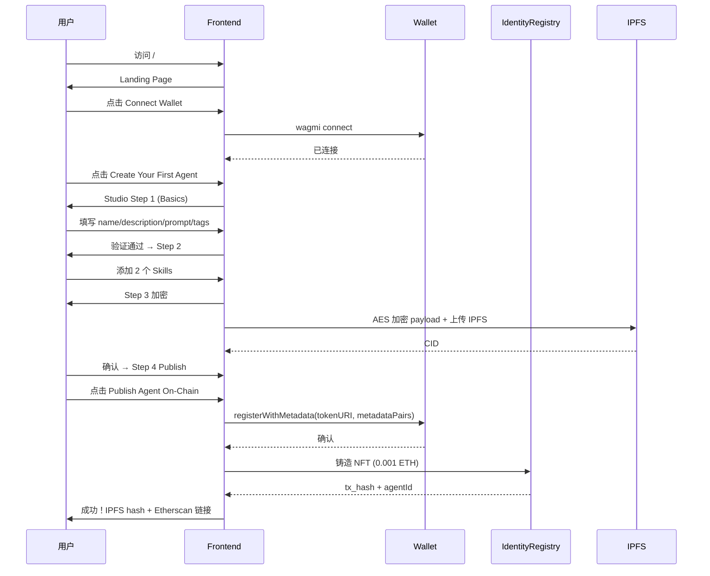
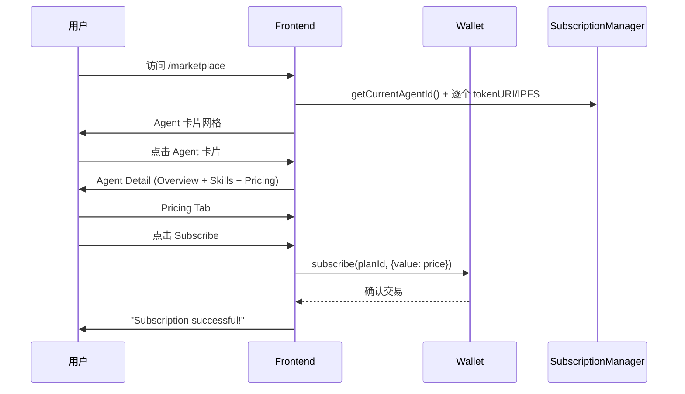
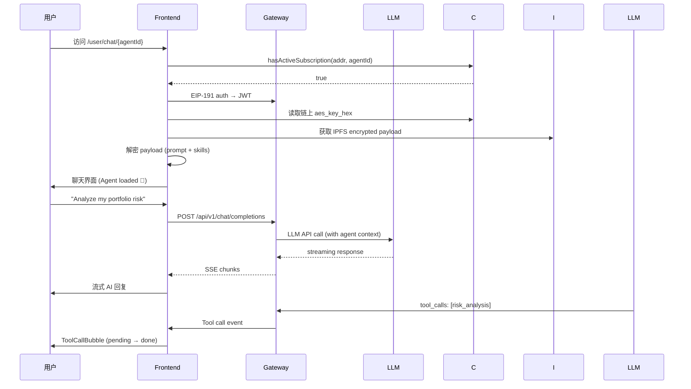
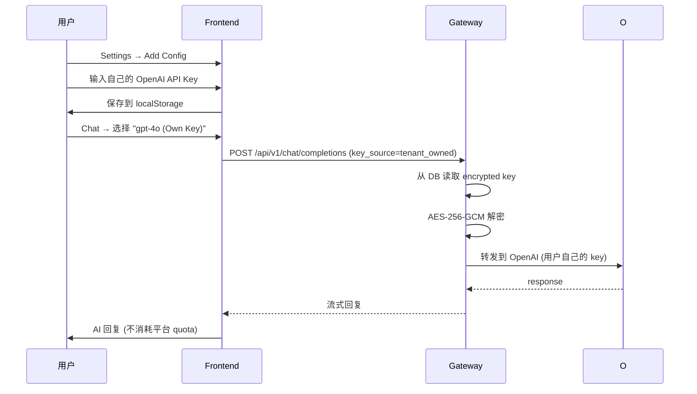
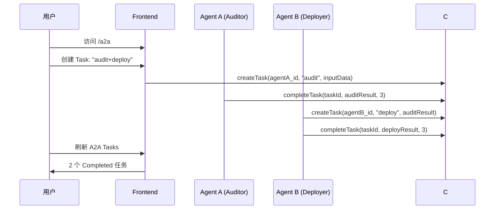
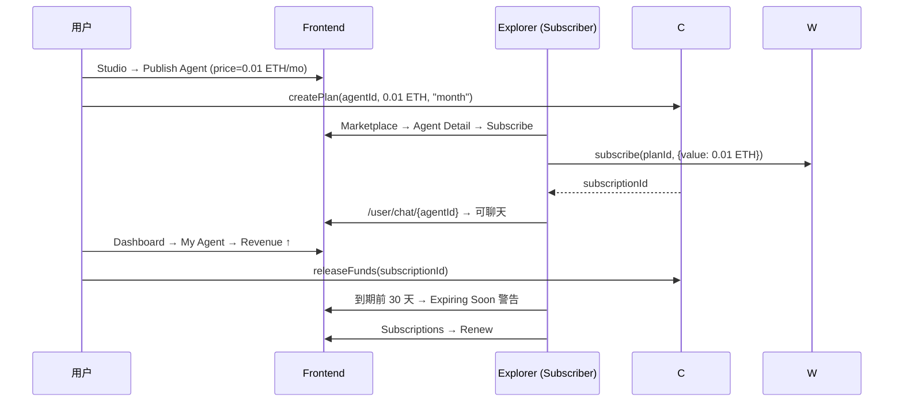
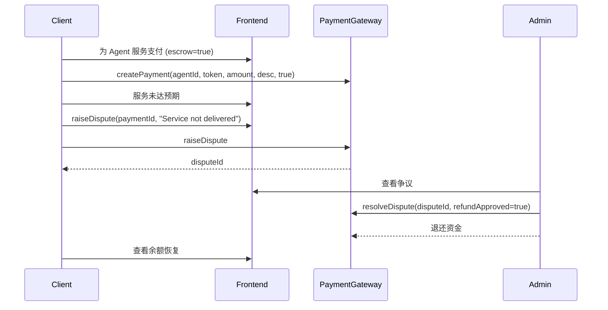
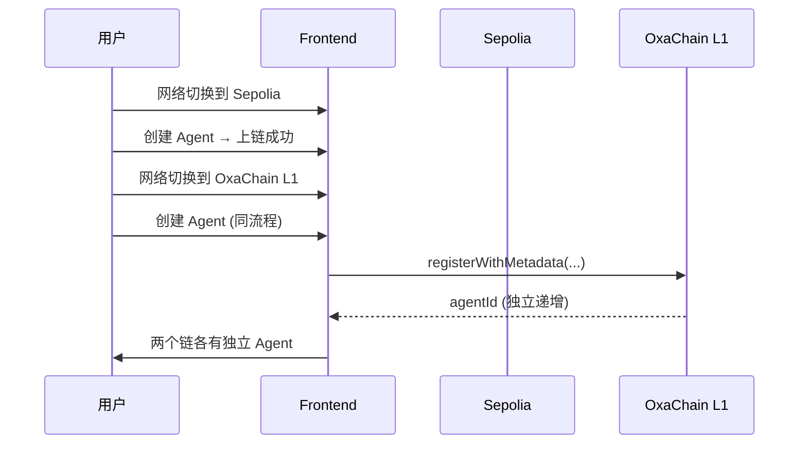
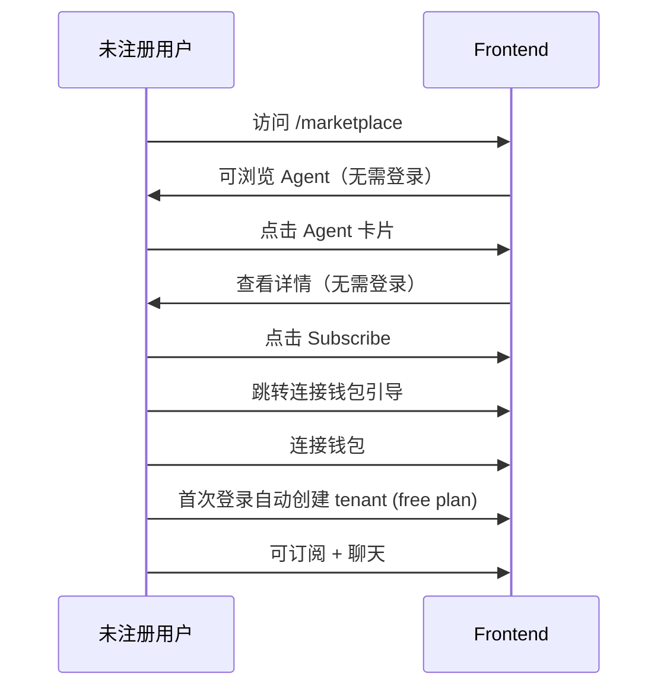
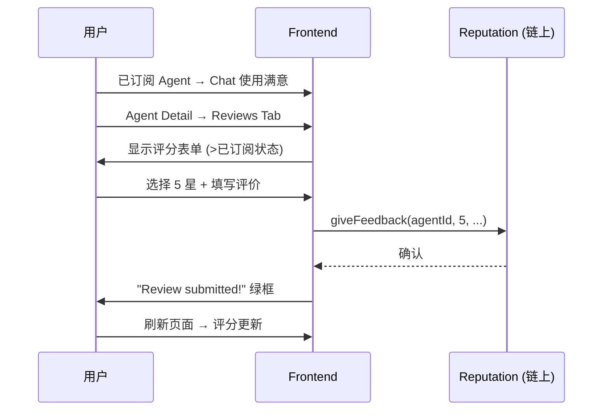

# AgentX — FT 前端测试场景

> 项目: AgentX (ERC-8004 AI Agent Platform)
> 技术栈: Next.js 14 + React 18 + Wagmi v2 + TypeScript
> 测试环境: Sepolia Testnet / OxaChain L1
> 生成时间: 2026-07-20

---

## 概述

AgentX Frontend 覆盖 21 个页面/路由，实现完整 AI Agent 经济的去中心化前端体验。测试覆盖用户页面、组件交互、全局 UI 状态和端到端业务流程闭环。

---

## 页面清单

| # | 页面 | 路由 | 核心功能 |
|---|------|------|----------|
| 1 | Landing Page | `/` | 产品展示 / CTA / 钱包连接 |
| 2 | Marketplace | `/marketplace` | Agent 搜索 / 标签过滤 / 卡片网格 |
| 3 | Agent Detail | `/marketplace/agent/[id]` | Agent 详情 / 技能 / 评价 / 订阅 |
| 4 | Studio - Basics | `/studio/basics` | Step 1: 名称/描述/System Prompt/标签 |
| 5 | Studio - Skills | `/studio/skills` | Step 2: MCP 工具/技能配置 |
| 6 | Studio - Encrypt | `/studio/encrypt` | Step 3: AES+ECIES 加密进度 |
| 7 | Studio - Publish | `/studio/publish` | Step 4: 审核摘要/确认上链 |
| 8 | User Dashboard | `/user/dashboard` | 统计卡片 / 我的 Agent / 订阅列表 |
| 9 | My Agents | `/user/agents` | 我的 Agent 管理 |
| 10 | Chat | `/user/chat/[agentId]` | Agent 对话 / 工具调用 / 模型选择 |
| 11 | Subscriptions | `/user/subscriptions` | 订阅管理 / 续费 |
| 12 | Subscription Detail | `/user/subscriptions/[id]` | 订阅详情 / 操作 |
| 13 | Subscription Renew | `/user/subscriptions/[id]/renew` | 续费页面 |
| 14 | Settings | `/user/settings` | LLM API Key 配置 |
| 15 | A2A Tasks | `/a2a` | A2A 任务列表 / 状态追踪 |
| 16 | Agent Dashboard | `/dashboard/agent` | Agent 数据运营仪表盘 |

---

## FT-1: 全局 UI 组件

### FT-1.1: 钱包连接 (WalletConnect)
| 步骤 | 操作 | 预期 |
|------|------|------|
| 1 | 未连接时访问任意页面 | 显示 "Connect Wallet" 按钮 |
| 2 | 点击按钮 | 弹出连接器列表（MetaMask, WalletConnect, Injected） |
| 3 | 选择 MetaMask | 触发钱包弹窗 |
| 4 | 确认连接 | 显示地址缩写 + 链网络标签 + 登出图标 |
| 5 | 切换网络 | 自动检测并显示当前链名称 |
| 6 | 点击断开 | 恢复 "Connect Wallet" 状态 |
| 7 | 锁定钱包后 | 页面自动检测断连状态 |

### FT-1.2: 网络切换器 (NetworkSwitcher)
| 步骤 | 操作 | 预期 |
|------|------|------|
| 1 | 点击网络标签 | 展开网络列表 |
| 2 | 支持的网络 | Sepolia / OxaChain L1 / zkSync Testnet / Polygon Mumbai / Base Sepolia |
| 3 | 切换网络 | 触发钱包弹窗切换 |
| 4 | 切换成功后 | 标签更新为新网络名称 |

### FT-1.3: 导航栏 (Header)
| 步骤 | 操作 | 预期 |
|------|------|------|
| 1 | 桌面端访问 | 显示 Logo + Marketplace + Studio 链接 |
| 2 | 移动端访问 | 收起为汉堡菜单 |
| 3 | 点击 Logo | 回到首页 `/` |
| 4 | 点击 Marketplace | 跳转 `/marketplace` |
| 5 | 点击 Studio | 跳转 `/studio/basics` |

### FT-1.4: 侧边栏 (Sidebar)
| 步骤 | 操作 | 预期 |
|------|------|------|
| 1 | 已连接钱包时访问 Dashboard | 左侧显示导航菜单 |
| 2 | 导航项 | Dashboard, My Agents, Subscriptions, A2A Tasks, Settings |
| 3 | 当前页高亮 | 选中项背景色区别于其他 |

### FT-1.5: 移动端导航 (MobileNav)
| 步骤 | 操作 | 预期 |
|------|------|------|
| 1 | 移动端视口 (< 768px) | 底部固定导航栏 |
| 2 | 5 个 Tab | Marketplace, Studio, Chat, Dashboard, Settings |
| 3 | 点击 Tab | 跳转对应路由 |

### FT-1.6: 错误边界 (ErrorBoundary)
| 步骤 | 操作 | 预期 |
|------|------|------|
| 1 | 触发 React 组件错误 | 显示友好错误页面 + 重试按钮 |
| 2 | 点击重试 | 重新渲染页面 |

### FT-1.7: 加载状态
| 步骤 | 操作 | 预期 |
|------|------|------|
| 1 | 首次进入 Marketplace | 显示 6 个骨架屏卡片 (skeleton) |
| 2 | 数据加载完成 | 骨架屏替换为实际 Agent 卡片 |
| 3 | 查询订阅列表 | 显示旋转 loader |
| 4 | Chat 加载 Agent 上下文 | 显示 "Decrypting..." 提示 |

### FT-1.8: 空状态 (Empty States)
| 步骤 | 操作 | 预期 |
|------|------|------|
| 1 | 未连接钱包访问 Dashboard | 显示 "Connect Your Wallet" 引导 |
| 2 | 无订阅访问 Subscriptions | 显示 "No subscriptions found" + Browse 按钮 |
| 3 | Agent 无技能 | Studio Skills 显示 "No skills yet" 虚线区域 |

### FT-1.9: 错误状态
| 步骤 | 操作 | 预期 |
|------|------|------|
| 1 | 网络断开 | 页面不崩溃，显示错误提示 |
| 2 | RPC 不可用 | 合约查询失败，显示 toast 或内联错误 |
| 3 | IPFS 超时 | Agent 卡片显示占位元数据 |
| 4 | 交易拒绝 (reject) | 显示错误消息，不阻塞 UI |

---

## FT-2: 页面专项测试

### FT-2.1: Landing Page (`/`)
| 步骤 | 操作 | 预期 |
|------|------|------|
| 1 | 访问首页 | Hero 标题 "Build AI Agents. Own Them On-Chain." |
| 2 | 查看统计 | 4 列数字（Agents Minted / Revenue / Contract Modules / LLMs） |
| 3 | 四大支柱 | Encrypted Ownership / Closed Skill / A2A / Any Model |
| 4 | 三步流程 | 01 Craft / 02 Encrypt & Publish / 03 Subscribe & Use |
| 5 | 加密模型卡片 | 3 步加密流程图（Creator → On-Chain → Subscriber） |
| 6 | CTA 按钮 | "Create Your First Agent" → `/studio` |
| 7 | CTA 按钮 | "Explore Marketplace" → `/marketplace` |
| 8 | Footer | GitHub 链接 + Sepolia Testnet 标识 |

### FT-2.2: Marketplace (`/marketplace`)
| 步骤 | 操作 | 预期 |
|------|------|------|
| 1 | 访问 | 显示 Agent 卡片网格 (3 列) |
| 2 | 搜索框输入 "defi" | 实时过滤包含 "defi" 的 Agent |
| 3 | 点击标签 "trading" | 只显示含 trading 标签的 Agent |
| 4 | 多选标签 | AND 逻辑过滤 |
| 5 | "Clear" 按钮 | 清除所有过滤器 |
| 6 | 加载更多 | 滚动/分页加载剩余 Agent |
| 7 | 点击 Agent 卡片 | 跳转 `/marketplace/agent/{id}` |
| 8 | 无 Agent 时 | 显示 "No Agents Found" 引导创建 |
| 9 | IPFS 元数据失败 | 显示 "Agent {id}" 占位名 + metadata-failed 标签 |

### FT-2.3: Agent Detail (`/marketplace/agent/[id]`)
| 步骤 | 操作 | 预期 |
|------|------|------|
| 1 | 访问已存在 Agent | 显示图标/名称/描述/评分/标签/定价 |
| 2 | Tab: Overview | 描述详情 + 右侧评分统计 + Website/GitHub 链接 |
| 3 | Tab: Skills | 技能列表 + 展开 Input/Output Schema |
| 4 | Tab: Reviews | 评分概览 + 已订阅时可提交评价 |
| 5 | Tab: Pricing | 计划卡片 + 订阅按钮 |
| 6 | 已订阅用户 | "Chat with Agent" + "Try Demo" 按钮 |
| 7 | 未订阅用户 | "Subscribe" 按钮可点击 |
| 8 | 未连接钱包 | 按钮 disabled, 提示连接 |
| 9 | 订阅操作 | loading → confirm → success toast |
| 10 | 订阅失败 | 红色错误提示 |
| 11 | 不存在 Agent | "Agent Not Found" + 返回按钮 |

### FT-2.4: Studio - Basics (`/studio/basics`)
| 步骤 | 操作 | 预期 |
|------|------|------|
| 1 | 步骤指示器 | 显示 4 步进度条，Step 1 高亮 |
| 2 | 输入 Agent Name | 实时显示 |
| 3 | 输入少于 3 字符 | 红色边框 + "Name must be at least 3 characters" |
| 4 | 输入超过 50 字符 | 红色边框 + "Name must not exceed 50 characters" |
| 5 | 空 Description | 提交时 "Description is required" |
| 6 | Description < 20 字符 | "Description must be at least 20 characters" |
| 7 | 空 System Prompt | 提交时 "System prompt is required" |
| 8 | Prompt < 10 字符 | "Prompt must be at least 10 characters" |
| 9 | 输入 Tags "defi, trading" | 逗号分隔解析 |
| 10 | 点击 "Next: Skills →" | 跳转 `/studio/skills` |

### FT-2.5: Studio - Skills (`/studio/skills`)
| 步骤 | 操作 | 预期 |
|------|------|------|
| 1 | 步骤指示器 | Step 2 高亮 |
| 2 | 点击 "Add Skill" | 新增一行 Skill 输入（name + description + endpoint） |
| 3 | 输入 Skill name "get_balance" | 实时显示 |
| 4 | 输入 Description | 实时显示 |
| 5 | 输入 Endpoint URL | 实时显示 |
| 6 | 添加 3 个 Skill | 3 行均可见 |
| 7 | 点击 "Remove" | 移除对应行 |
| 8 | 不添加 Skill 直接下一步 | 允许（非必填） |
| 9 | "← Back" 按钮 | 回到 `/studio/basics` |
| 10 | "Next: Setup →" | 跳转 `/studio/encrypt` |

### FT-2.6: Studio - Encrypt (`/studio/encrypt`)
| 步骤 | 操作 | 预期 |
|------|------|------|
| 1 | 步骤指示器 | Step 3 高亮 |
| 2 | 加密进度条 | 显示 AES key 生成 / 加密 / IPFS 上传进度 |
| 3 | 加密完成 | 显示 CID |
| 4 | "← Back" 按钮 | 回到 `/studio/skills` |
| 5 | "Next: Publish →" | 跳转 `/studio/publish` |

### FT-2.7: Studio - Publish (`/studio/publish`)
| 步骤 | 操作 | 预期 |
|------|------|------|
| 1 | 审核摘要 | Name / Description / Skills count / Pricing / Tags / Encryption / Storage |
| 2 | 未连接钱包 | 黄色警告 "Connect your wallet to publish." |
| 3 | 已连接钱包 | "Publish Agent On-Chain" 按钮可点击 |
| 4 | 点击发布 | 显示 "Publishing..." → 确认 → 显示 tx hash |
| 5 | 发布成功 | 绿色卡片: IPFS hash + Etherscan 链接 |
| 6 | 发布失败 | 红色错误信息 |
| 7 | 拒绝交易 | 显示错误，可重试 |
| 8 | "← Back" 按钮 | 回到 `/studio/encrypt` |

### FT-2.8: Dashboard (`/user/dashboard`)
| 步骤 | 操作 | 预期 |
|------|------|------|
| 1 | 访问已连接 | 4 张统计卡片: My Agents / Active Subs / Total Calls / Total Spent |
| 2 | 我的 Agent 区块 | 最多显示 6 个 Agent 卡片 |
| 3 | Tab: Active | 只显示活跃订阅 |
| 4 | Tab: Expired | 只显示过期订阅 |
| 5 | Tab: All | 显示全部 |
| 6 | 订阅卡片信息 | Agent 名 / 状态标签 / 日期 / 调用数 / 花费 |
| 7 | 到期警告 | 显示 "Expires ..." + Renew 链接 |
| 8 | Chat 按钮 | 跳转 `/user/chat/{agentId}` |
| 9 | Refresh 按钮 | 重新拉取订阅数据 |
| 10 | Settings / Explore 按钮 | 跳转对应页面 |

### FT-2.9: Chat (`/user/chat/[agentId]`)
| 步骤 | 操作 | 预期 |
|------|------|------|
| 1 | 无活跃订阅访问 | SubscriptionGuard 门禁 → "Subscription Required" |
| 2 | 有活跃订阅访问 | 聊天界面加载 |
| 3 | 加载 Agent | 显示 Agent 名称 + 🔐 E2E Encrypted |
| 4 | 解密中 | "Decrypting..." 提示 |
| 5 | 空消息 | "Start the Conversation" + 预览技能标签 |
| 6 | 输入消息发送 | 用户消息气泡（右对齐） |
| 7 | 收到流式回复 | 增量渲染 AI 响应 |
| 8 | Tool Call 显示 | ToolCallBubble 组件（技能名 + 输入/输出） |
| 9 | Tool Call pending | 旋转动画 |
| 10 | Tool Call error | 红色错误提示 |
| 11 | 思考提示 | 居中显示 thinking text |
| 12 | 停止按钮 | 点击 Stop 中止 AgentLoop |
| 13 | 模型选择器 | Platform Models / Own Key 分组 |
| 14 | 选择 Platform 模型 | 使用 token quota |
| 15 | 选择 Own Key 模型 | 使用自有 API key |
| 16 | 用量显示 | tokens 使用量 / 每日额度 |
| 17 | 清空历史 | Trash 按钮清除 |
| 18 | 历史持久化 | 刷新页面后消息保留（localStorage） |
| 19 | 错误状态 | "Loop error: ..." 颜色区分 |
| 20 | 返回按钮 | 回到 Dashboard |

### FT-2.10: Settings (`/user/settings`)
| 步骤 | 操作 | 预期 |
|------|------|------|
| 1 | 访问 | 已配置列表（如有）或空状态 |
| 2 | "Add Config" | 弹出表单 |
| 3 | 选择 Provider: OpenAI | model 下拉更新为 GPT 系列 |
| 4 | 选择 Provider: DeepSeek | model 下拉更新为 deepseek-chat 等 |
| 5 | 输入 API Key | 密码框遮蔽 |
| 6 | 保存 | 列表新增一条 |
| 7 | 点击 Activate | 该配置标记为 Active (绿标) |
| 8 | 编辑配置 | 表单预填充当前值 |
| 9 | 删除配置 | 从列表移除 |
| 10 | localStorage 持久化 | 刷新后配置保留 |

### FT-2.11: Subscriptions (`/user/subscriptions`)
| 步骤 | 操作 | 预期 |
|------|------|------|
| 1 | Tab: Active | 活跃订阅列表 |
| 2 | Tab: Expiring Soon | 30 天内到期的 |
| 3 | Tab: Expired | 已过期列表 |
| 4 | 到期警告横幅 | 黄色背景 + "Expires in X days" |
| 5 | Chat 按钮 | 跳转聊天 |
| 6 | Details 按钮 | 跳转订阅详情 |
| 7 | Browse 按钮 | 跳转 Marketplace |

### FT-2.12: A2A Tasks (`/a2a`)
| 步骤 | 操作 | 预期 |
|------|------|------|
| 1 | 未连接钱包 | "Connect Your Wallet" 引导 |
| 2 | 已连接 | 任务列表（如有） |
| 3 | Tab: All / Active / Completed | 过滤显示 |
| 4 | 展开任务 Input | details 展开显示 JSON |
| 5 | 展开任务 Output | details 展开显示 JSON |
| 6 | 状态图标 | Created(黄) / In Progress(蓝) / Completed(绿) / Failed(红) |
| 7 | 无任务 | "No Tasks Yet" 引导说明 |
| 8 | 刷新按钮 | 重新加载任务列表 |

### FT-2.13: Agent Dashboard (`/dashboard/agent`)
| 步骤 | 操作 | 预期 |
|------|------|------|
| 1 | Agent 注册表单 | 铸造 Agent NFT 表单 |
| 2 | 卡片管理 | AgentCardManager 显示/编辑 Agent 信卡片 |
| 3 | 端点管理 | EndpointManager 配置 MCP 端点 |
| 4 | 配置管理 | ConfigurationManager 管理元数据 |
| 5 | 订阅管理 | SubscriptionManager 查看/管理订阅方 |
| 6 | 收益展示 | RevenueDisplay 展示累计收益 |

---

## FT-3: E2E 业务流程闭环

### E2E-1: 钱包连接 → Agent 创建 → 上链发布

### E2E-2: 市场浏览 → Agent 详情 → 订阅

### E2E-3: 订阅后 → Agent 对话 → Skill 调用

### E2E-4: BYOK 模式聊天

### E2E-5: A2A 多 Agent 协作

### E2E-6: 订阅全生命周期

### E2E-7: 支付争议流程

### E2E-8: 双链部署体验

### E2E-9: 未注册/未订阅体验

### E2E-10: 评价闭环

---

## 测试统计

| 分类 | 场景数 |
|------|--------|
| FT-1: 全局 UI 组件 | 9 |
| FT-2: 页面专项 | ~128 |
| FT-3: E2E 业务流程闭环 | 10 |
| **合计** | **~147** |

---

## 浏览器兼容性

| 浏览器 | 版本 | 状态 |
|--------|------|------|
| Chrome | 120+ | ✅ |
| Firefox | 120+ | ✅ |
| Safari | 17+ | ✅ |
| Edge | 120+ | ✅ |
| Mobile Chrome | 120+ | ✅ |
| Mobile Safari | 17+ | ✅ |

## 响应式断点

| 断点 | 宽度 | 布局行为 |
|------|------|----------|
| Desktop | ≥1024px | 侧边栏 + 主内容区 |
| Tablet | 768-1023px | 收起侧边栏，顶部导航 |
| Mobile | <768px | 底部 Tab 导航，单列布局 |
